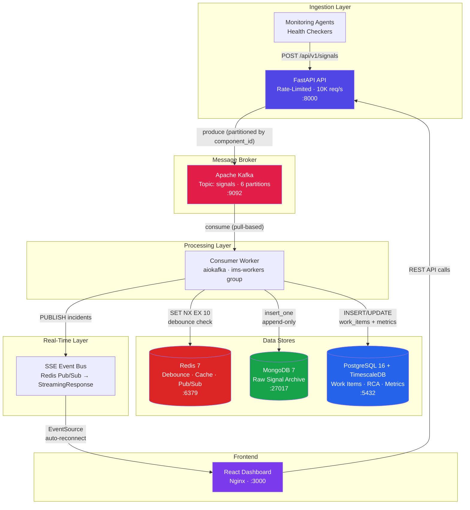
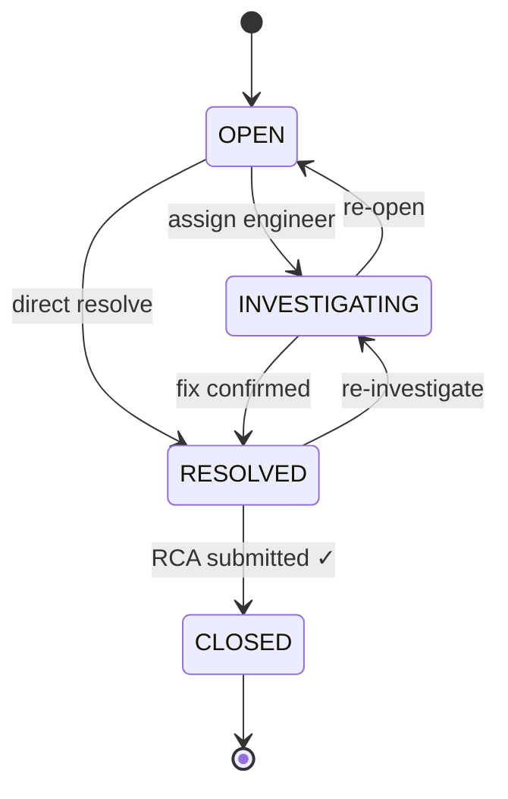
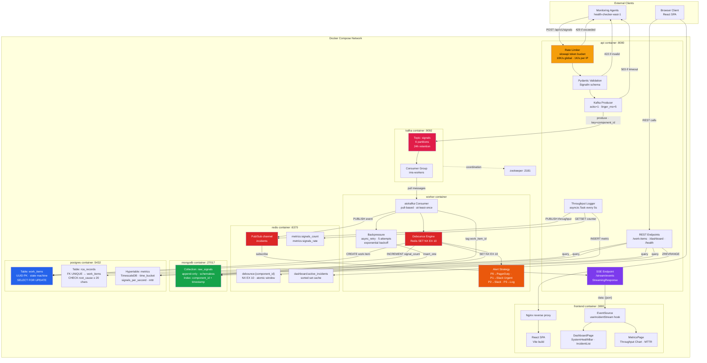

# IMS — Incident Management System

A production-grade incident management platform that ingests failure signals at scale, deduplicates them into actionable work items using a Redis-based debounce algorithm, and serves a real-time React dashboard via Server-Sent Events.

> **Live API Docs:** Start the stack and visit [`http://localhost:8000/docs`](http://localhost:8000/docs) for interactive Swagger UI.

---

## Architecture Overview



---

## Tech Stack

| Technology              | Role                       | Why This Over Alternatives                                                                                                      |
| ----------------------- | -------------------------- | ------------------------------------------------------------------------------------------------------------------------------- |
| **Python + FastAPI**    | Async API server           | Native `async/await`, Pydantic validation, auto-generated OpenAPI. Django is sync-first; Flask has no built-in async.           |
| **Apache Kafka**        | Durable signal buffer      | Partitioned log survives crashes. Consumer groups for horizontal scaling. RabbitMQ has no durable replay.                       |
| **Redis 7**             | Debounce + cache + pub/sub | Sub-ms `SET NX EX` for atomic debounce. Pub/Sub for SSE fan-out. Memcached lacks pub/sub and atomic set-if-not-exists.          |
| **MongoDB 7**           | Raw signal archive         | Schema-flexible append-only writes for heterogeneous signal payloads. No migrations needed.                                     |
| **PostgreSQL 16**       | Transactional state        | ACID for state machine transitions. `SELECT FOR UPDATE` for race-free concurrency.                                              |
| **TimescaleDB**         | Time-series metrics        | Hypertable auto-partitioning on PostgreSQL — no separate service. `time_bucket()` for aggregation.                              |
| **SSE (not WebSocket)** | Real-time push             | Unidirectional server→client fits dashboard. Built-in `EventSource` auto-reconnect. Simpler than WebSocket for read-only feeds. |
| **aiokafka**            | Async Kafka client         | Native asyncio — no thread-pool bridging. Fits FastAPI's event loop.                                                            |
| **asyncpg**             | Async PostgreSQL driver    | Fastest Python async PG driver. Prepared statements + connection pooling.                                                       |

---

## Infrastructure

### Docker Compose Topology

| Container   | Image                              | Purpose                                  | Port  |
| ----------- | ---------------------------------- | ---------------------------------------- | ----- |
| `api`       | Custom Python (FastAPI)            | Signal ingestion, REST API, SSE stream   | 8000  |
| `worker`    | Custom Python                      | Kafka consumer → debounce → store        | —     |
| `kafka`     | confluentinc/cp-kafka:7.6.0        | Message broker (6 partitions)            | 9092  |
| `zookeeper` | confluentinc/cp-zookeeper:7.6.0    | Kafka coordination                       | 2181  |
| `redis`     | redis:7-alpine                     | Debounce state, dashboard cache, pub/sub | 6379  |
| `mongodb`   | mongo:7                            | Raw signal archive                       | 27017 |
| `postgres`  | timescale/timescaledb:latest-pg16  | Work items, RCA, metrics hypertable      | 5432  |
| `frontend`  | node:20-alpine → nginx:1.27-alpine | React SPA (multi-stage build)            | 3000  |

### Service Dependencies

```
kafka-init ──► kafka ──► zookeeper
worker ──► kafka-init, redis, mongodb, postgres
api ──► kafka, redis, mongodb, postgres
frontend ──► api
```

**Hot-reload:** `api` and `worker` mount `./backend` as a volume with `--reload`. The `frontend` is a static Nginx image — code changes require `docker compose build frontend`.

---

## Signal Pipeline — End-to-End Flow

```
1. Signal arrives at POST /api/v1/signals
2. Rate limiter checks (token bucket: 10K/s global, 1K/s per IP)
   → Over limit: return 429 with Retry-After header
3. Pydantic validates payload schema
   → Invalid: return 422
4. Signal produced to Kafka topic "signals" (partitioned by component_id)
   → Return 202 Accepted immediately (async handoff)
5. Kafka consumer picks up signal from assigned partition
6. Insert raw signal into MongoDB (append-only, with retry)
7. Debounce check: Redis SET debounce:{component_id} NX EX 10
   → Key exists (SET returns nil): increment signal_count on existing work item
   → Key is new (SET returns OK): create new work item in PostgreSQL
     a. Determine severity from component_id → severity mapping
     b. Execute alerting strategy for severity level
8. Tag MongoDB signal document with resolved work_item_id
9. Publish event to Redis Pub/Sub channel "incidents"
10. SSE endpoint pushes event to all connected React clients
11. Dashboard updates in real-time
```

---

## Backpressure — The 5-Layer Defense

This is the core resilience architecture. Every boundary between components has an explicit overflow strategy — no layer can overwhelm the next.

```
┌──────────────────────────────────────────────────────────────┐
│  Layer 1: Client → API        Rate limiter rejects with 429  │
│  Layer 2: API → Kafka         Producer timeout returns 503   │
│  Layer 3: Kafka → Consumer    Disk retention buffers spikes  │
│  Layer 4: Consumer → MongoDB  Async retry + exponential back │
│  Layer 5: Consumer → Postgres Async retry + exponential back │
└──────────────────────────────────────────────────────────────┘
```

### Layer-by-Layer Detail

**Layer 1 — Rate Limiting (API edge)**

- Token bucket via `slowapi`: 10,000 req/s global, 1,000 req/s per source IP
- Allows bursts up to bucket size while enforcing sustained rate
- Returns HTTP 429 with `Retry-After` header

**Layer 2 — Kafka Producer**

- `acks=1` (leader ACK — balances durability vs latency)
- `max_block_ms=5000` — if Kafka is unreachable for 5s, return 503
- Signal is not lost: client receives 503 and knows to retry

**Layer 3 — Kafka Retention (the shock absorber)**

- This is _why Kafka exists_ in this architecture
- Signals retained on disk for 24 hours
- Consumer reads are pull-based — Kafka never overwhelms the consumer
- If consumers crash or slow down, signals wait safely in Kafka

**Layer 4/5 — Database Write Retries**

- Exponential backoff: `min(2^attempt × 100ms, 30s)` with ±10% jitter
- Max 5 retries per operation
- After exhaustion: log error, continue processing (Kafka offset committed only after success)
- Consumer does not block: uses `asyncio.create_task` for non-critical retries

### What Happens During a Full PostgreSQL Outage

1. Consumer retries 5 times with backoff (~60s total)
2. Signal processing fails; Kafka offset is NOT committed
3. Consumer continues attempting next messages (MongoDB writes may still succeed)
4. When PostgreSQL recovers, uncommitted offsets are replayed automatically
5. `/health` endpoint reports `degraded` status

---

## Design Patterns

### State Pattern — Incident Lifecycle

Work items transition through a strict state machine. Each state is a class that encapsulates its own transition rules — invalid transitions are impossible at the type level.



- **INVESTIGATING** requires an `assignee` (enforced by `InvestigatingState.on_enter()`)
- **CLOSED** requires a complete RCA (enforced by `ClosedState.on_enter()`)
- **Concurrency safety:** `SELECT FOR UPDATE` in PostgreSQL ensures two concurrent transitions on the same work item are serialized — one blocks, the other sees the updated state

### Strategy Pattern — Alerting

Different severity levels trigger different notification strategies at runtime:

| Severity | Strategy                   | Action                    |
| -------- | -------------------------- | ------------------------- |
| P0       | `PagerDutyAlertStrategy`   | Page on-call immediately  |
| P1       | `SlackUrgentAlertStrategy` | Post to #incidents-urgent |
| P2       | `SlackAlertStrategy`       | Post to #incidents        |
| P3       | `LogOnlyAlertStrategy`     | Log and dashboard only    |

Adding a new component: one entry in `COMPONENT_SEVERITY`. Adding a new alert channel: one `AlertStrategy` subclass. Zero changes to existing code.

---

## Debounce Algorithm

**Problem:** 100 signals for the same `component_id` in 10 seconds must produce exactly 1 work item.

**Mechanism:** `Redis SET debounce:{component_id} {work_item_id} NX EX 10`

- `NX` = set only if key does not exist (atomic check-and-set)
- `EX 10` = auto-expire after 10 seconds
- Returns `OK` → caller is the "winner", creates work item
- Returns `nil` → key exists, increment existing work item's `signal_count`

**Why this is race-safe:** Even if two signals for the same `component_id` arrive simultaneously on different consumer instances, `SET NX` is atomic in Redis — exactly one wins. The loser increments the winner's work item. No two-step write, no window where GET returns empty.

**Window boundaries:** If signal 101 arrives at T=10.001s (after expiry), a new work item is created. This is correct: it represents a new incident window.

---

## Real-Time Dashboard (SSE)

```
Consumer → Redis PUBLISH "incidents" → FastAPI SSE endpoint → EventSource → React
```

**Event types:**
| Event | Trigger |
|---|---|
| `incident.created` | New work item created (debounce winner) |
| `incident.updated` | Signal count incremented (debounce loser) |
| `incident.transitioned` | State machine transition |
| `incident.closed` | RCA submitted, work item closed |
| `metrics.throughput` | Periodic throughput measurement |

**Why SSE over WebSocket:** Unidirectional push, built-in `EventSource` auto-reconnect, works through HTTP proxies, ~20 lines vs ~100+ for WebSocket with heartbeat/reconnect.

**Connection management:** Keep-alive every 15s, `X-Accel-Buffering: no` for Nginx, `try/finally` cleanup of Redis Pub/Sub subscriptions to prevent connection leaks.

---

## Database Architecture

Each store has exactly ONE responsibility:

| Store           | Responsibility        | Key Insight                                                                               |
| --------------- | --------------------- | ----------------------------------------------------------------------------------------- |
| **Kafka**       | Durable signal buffer | Never queried — exists solely to decouple ingestion from processing                       |
| **Redis**       | Ephemeral state       | `debounce:*` (SET NX EX), `dashboard:*` (sorted set cache), `incidents` (pub/sub channel) |
| **MongoDB**     | Raw signal archive    | Append-only `insert_one`. Schema-flexible for heterogeneous `metadata` payloads           |
| **PostgreSQL**  | Transactional state   | `work_items` (state machine), `rca_records` (FK with CHECK constraints)                   |
| **TimescaleDB** | Time-series metrics   | `metrics` hypertable on PostgreSQL — `time_bucket()` aggregations                         |

### Schema

**`work_items`** — `id` (UUID PK), `component_id`, `severity` (P0–P3), `status` (OPEN/INVESTIGATING/RESOLVED/CLOSED), `title`, `assignee`, `signal_count`, `created_at`, `updated_at`, `resolved_at`, `mttr_seconds`

**`rca_records`** — `id` (UUID PK), `work_item_id` (FK UNIQUE), `root_cause` (≥20 chars), `mitigation`, `prevention`, `submitted_by`, `submitted_at`

**`metrics`** — TimescaleDB hypertable: `time`, `metric_name`, `value`, `labels` (JSONB)

---

## API Reference

Base path: `/api/v1` (except `/health`)

| Method  | Path                          | Description                            |
| ------- | ----------------------------- | -------------------------------------- |
| `POST`  | `/signals`                    | Ingest a failure signal → Kafka (202)  |
| `GET`   | `/work-items`                 | List incidents (paginated, filterable) |
| `GET`   | `/work-items/{id}`            | Get a single work item                 |
| `PATCH` | `/work-items/{id}/transition` | State machine transition               |
| `POST`  | `/work-items/{id}/rca`        | Submit RCA → auto-close                |
| `GET`   | `/work-items/{id}/signals`    | Raw signals from MongoDB               |
| `GET`   | `/work-items/{id}/timeline`   | Cross-store incident timeline          |
| `GET`   | `/dashboard/active`           | Active incidents (Redis cache)         |
| `GET`   | `/dashboard/metrics`          | Recent TimescaleDB metrics             |
| `GET`   | `/stream/events`              | SSE real-time event stream             |
| `GET`   | `/analytics/throughput`       | Time-series throughput buckets         |
| `GET`   | `/analytics/component-health` | Per-component health aggregation       |
| `GET`   | `/system/health-summary`      | O(1) system snapshot                   |
| `GET`   | `/health`                     | Infrastructure liveness probes         |

> **Interactive docs:** [`http://localhost:8000/docs`](http://localhost:8000/docs) (Swagger UI) · [`http://localhost:8000/redoc`](http://localhost:8000/redoc) (ReDoc)

---

## Quick Start

```bash
# 1. Start all services
docker compose up -d

# 2. Verify containers
docker compose ps

# 3. Open the dashboard
open http://localhost:3000

# 4. Open API docs
open http://localhost:8000/docs

# 5. Run demo load test (requires k6)
k6 run scripts/demo_scenario.js
```

### Seed Script

Simulate an RDBMS outage cascade:

```bash
python scripts/seed_failure_event.py
```

Expected: 4 work items created (one per component), others deduplicated. P0 alert for `database`. Dashboard updates in real-time.

---

## Detailed System Architecture



---

## MTTR Calculation

- **Start:** `work_item.created_at` (first signal timestamp)
- **End:** `rca_record.submitted_at` (RCA submission timestamp)
- **Formula:** `MTTR = end - start` (seconds)
- **Computed in:** `ClosedState.on_enter()` after RCA validation
- **Stored in:** `work_items.mttr_seconds` + TimescaleDB `metrics` hypertable

---

## Testing

| Test Suite                | What It Validates                                                |
| ------------------------- | ---------------------------------------------------------------- |
| `test_state_machine.py`   | All valid/invalid transitions, RCA gating, assignee requirements |
| `test_debounce.py`        | 100 signals → 1 work item, window expiry, signal count increment |
| `test_alert_strategy.py`  | Severity → strategy mapping, component registry                  |
| `test_rca_validation.py`  | Min-length, required fields, wrong-state rejection               |
| `test_backpressure.py`    | Retry counts, exponential backoff timing, failure callbacks      |
| `test_api_integration.py` | E2E: signal → work item → transition → RCA → close               |

```bash
# Run all tests
cd backend && python -m pytest tests/ -v
```

---

## Repository Structure

```
ims/
├── docker-compose.yml              # 8 services + 2 volumes
├── README.md                       # This document
├── docs/
│   ├── design.md                   # Full architectural design document
│   └── design_update.md            # Post-implementation amendments
├── scripts/
│   ├── demo_scenario.js            # k6 load test (normal + spike)
│   ├── seed_failure_event.py       # RDBMS outage cascade simulation
│   └── visualize_results.py        # Throughput graph generator
├── backend/
│   ├── Dockerfile
│   ├── requirements.txt
│   ├── db/
│   │   └── init.sql                # PostgreSQL + TimescaleDB schema
│   ├── app/
│   │   ├── main.py                 # FastAPI app factory + lifespan
│   │   ├── config.py               # pydantic-settings configuration
│   │   ├── api/
│   │   │   ├── signals.py          # POST /signals (ingestion)
│   │   │   ├── work_items.py       # GET/PATCH work items
│   │   │   ├── rca.py              # POST RCA submission
│   │   │   ├── dashboard.py        # Active incidents + SSE stream
│   │   │   ├── analytics.py        # Throughput + component health
│   │   │   ├── system_health.py    # O(1) health snapshot
│   │   │   ├── timeline.py         # Cross-store incident timeline
│   │   │   ├── signals_query.py    # MongoDB raw signal retrieval
│   │   │   └── health.py           # Infrastructure liveness probes
│   │   ├── core/
│   │   │   ├── state_machine.py    # State Pattern implementation
│   │   │   ├── alert_strategy.py   # Strategy Pattern implementation
│   │   │   ├── debounce.py         # Redis debounce logic
│   │   │   └── backpressure.py     # Retry wrapper + exponential backoff
│   │   ├── consumer/
│   │   │   └── signal_consumer.py  # Kafka consumer worker
│   │   ├── models/
│   │   │   ├── signal.py           # Pydantic signal schema
│   │   │   ├── work_item.py        # Work item response model
│   │   │   └── rca.py              # RCA request model
│   │   └── db/
│   │       ├── postgres.py         # asyncpg pool
│   │       ├── mongodb.py          # motor client
│   │       ├── redis_client.py     # aioredis client
│   │       └── kafka.py            # aiokafka producer/consumer
│   └── tests/
│       ├── test_state_machine.py
│       ├── test_debounce.py
│       ├── test_alert_strategy.py
│       ├── test_rca_validation.py
│       ├── test_backpressure.py
│       └── test_api_integration.py
└── frontend/
    ├── Dockerfile                  # Multi-stage: node build → nginx serve
    ├── package.json
    ├── nginx.conf
    └── src/
        ├── App.jsx
        ├── main.jsx
        ├── styles.css
        ├── hooks/
        │   └── useIncidentStream.js  # SSE EventSource hook
        ├── components/
        │   ├── SystemHealthBar.jsx
        │   ├── IncidentList.jsx
        │   ├── IncidentCard.jsx
        │   ├── IncidentDetail.jsx
        │   ├── IncidentTimeline.jsx
        │   ├── RCAForm.jsx
        │   ├── StateTransitionPanel.jsx
        │   ├── SignalDrawer.jsx
        │   └── ComponentHealthTable.jsx
        ├── pages/
        │   ├── DashboardPage.jsx
        │   ├── MetricsPage.jsx
        │   └── AnalyticsPage.jsx
        └── api/
            └── client.js
```

---

## Key Design Decisions

| Decision           | Choice                                | Rationale                                                         |
| ------------------ | ------------------------------------- | ----------------------------------------------------------------- |
| Debounce location  | After Kafka (in consumer)             | Must not block ingestion. Raw signals must always be stored.      |
| Debounce mechanism | Redis `SET NX EX`                     | Atomic, sub-ms, no application locking. Exact 10s TTL.            |
| State transitions  | `SELECT FOR UPDATE`                   | Pessimistic locking — transitions are high-stakes, low-frequency. |
| RCA enforcement    | Inside `ClosedState.on_enter()`       | Cannot be bypassed by API callers.                                |
| Signal storage     | MongoDB (separate from work items)    | Heterogeneous payloads, append-only, no ACID needed.              |
| Live dashboard     | SSE via Redis Pub/Sub                 | Unidirectional push, auto-reconnect, zero client deps.            |
| Kafka partitioning | By `component_id`                     | Ordering per component — same component processed sequentially.   |
| MTTR timing        | `created_at` → `rca.submitted_at`     | Full lifecycle including investigation and RCA authoring.         |
| Retry strategy     | Exponential backoff + bounded retries | Prevents infinite loops. Consumer doesn't block on retries.       |
