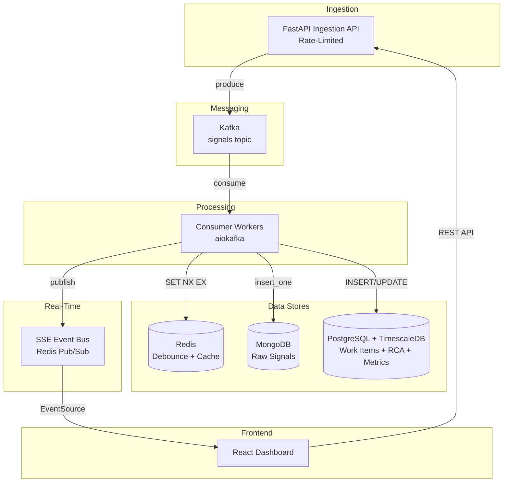

# IMS

Incident Management System (IMS) that ingests failure signals, deduplicates incidents, and serves a real-time dashboard.

## Architecture



## Quick Start

1. Start services:

```bash
docker compose up -d
```

2. Verify containers are running:

```bash
docker compose ps
```

3. Open the dashboard:

- http://localhost:3000

## API Endpoints

Base path: `/api/v1` (except `/health`)

| Method | Path | Description |
| --- | --- | --- |
| POST | `/signals` | Ingest failure signals (Kafka queue) |
| GET | `/work-items` | List work items (paginated) |
| GET | `/work-items/{id}` | Get a single work item |
| PATCH | `/work-items/{id}/transition` | Transition a work item state |
| POST | `/work-items/{id}/rca` | Submit RCA and auto-close |
| GET | `/dashboard/active` | Active incidents for dashboard |
| GET | `/dashboard/metrics` | Recent metrics from TimescaleDB |
| GET | `/stream/events` | SSE stream for real-time updates |
| GET | `/health` | Health status and throughput (root endpoint) |

## Backpressure Chain

1. Client → API: rate limiter rejects with 429 on excess load.
2. API → Kafka: producer timeouts return 503 if Kafka is unreachable.
3. Kafka → Consumer: durable retention buffers spikes safely.
4. Consumer → MongoDB: async retry with exponential backoff.
5. Consumer → PostgreSQL: async retry with exponential backoff.

## Seed Script

Simulate an RDBMS outage cascade:

```bash
python scripts/seed_failure_event.py
```

Expected outcome:
- 4 work items created (one per component), others deduplicated
- P0 alert triggered for `database`
- Dashboard shows the four active incidents in real time

## Services

- API: http://localhost:8000
- Kafka: localhost:9092
- Redis: localhost:6379
- MongoDB: localhost:27017
- PostgreSQL/TimescaleDB: localhost:5432

## Notes

- Database schemas are initialized by [backend/db/init.sql](backend/db/init.sql).
- Architecture details live in [docs/design.md](docs/design.md).
