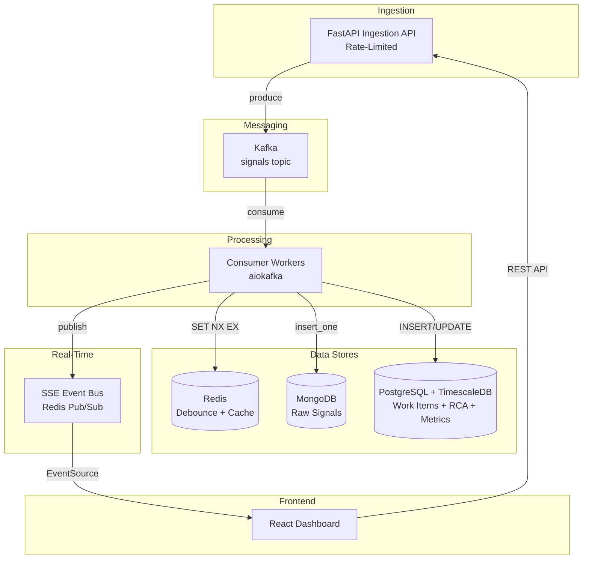
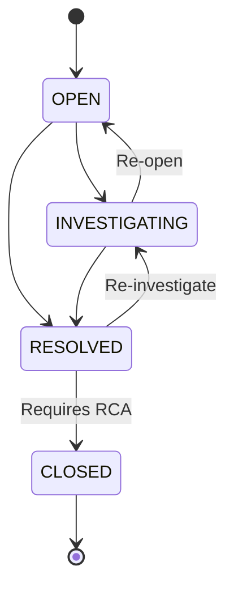

# IMS — Architectural Design Document

## 1. Architecture Overview



### Services in Docker Compose

| Container | Image | Purpose |
|-----------|-------|---------|
| `api` | Custom Python | FastAPI app: ingestion + REST + SSE |
| `worker` | Custom Python | Kafka consumer workers |
| `kafka` | confluentinc/cp-kafka | Message broker |
| `zookeeper` | confluentinc/cp-zookeeper | Kafka dependency |
| `redis` | redis:7-alpine | Debounce state + pub/sub + dashboard cache |
| `mongodb` | mongo:7 | Raw signal archive |
| `postgres` | timescale/timescaledb:latest-pg16 | Work items + RCA + metrics hypertables |
| `frontend` | node:20-alpine (build) | React SPA served via nginx |

> TimescaleDB is a PostgreSQL extension. We use the `timescale/timescaledb` image which is PostgreSQL with the extension pre-installed. There is no separate TimescaleDB container.

---

## 2. Tech Stack Justification

| Choice | Why This | Why Not The Alternative |
|--------|----------|------------------------|
| **Python + FastAPI** | Async-native (`async/await`), first-class Pydantic validation, auto-generated OpenAPI docs. Pattern-friendly for Strategy/State. | Django: synchronous by default, heavier ORM. Flask: no built-in async, no validation. |
| **Kafka** | Durable, partitioned log. Survives consumer crashes. Built-in consumer groups for horizontal scaling. Handles 10K+/sec trivially. | RabbitMQ: no durable replay. Redis Streams: less mature consumer group semantics, no built-in partition rebalancing. |
| **Redis** | Sub-ms reads. Atomic `SET NX EX` for debounce. Pub/Sub for SSE fan-out. Ephemeral data fits its volatility model. | Memcached: no pub/sub, no atomic set-if-not-exists with TTL. |
| **MongoDB** | Schema-flexible append-only writes. Handles heterogeneous signal payloads without migrations. High write throughput. | PostgreSQL JSONB: works but mixes audit trail with transactional data, violating single-responsibility. |
| **PostgreSQL** | ACID transactions for state machines. `SELECT FOR UPDATE` for race-free transitions. Mature ecosystem (asyncpg, SQLAlchemy). | MongoDB: no multi-document ACID by default. MySQL: weaker JSON support, less extension ecosystem. |
| **TimescaleDB** | Purpose-built time-series on PostgreSQL. Hypertables auto-partition by time. Compression + retention policies. No new service to operate. | InfluxDB: separate service, separate query language. Prometheus: pull-based, not suited for application metrics storage. |
| **SSE (not WebSocket)** | Unidirectional server→client fits dashboard push. Auto-reconnect built into `EventSource` API. Simpler than WebSocket for read-only feeds. | WebSocket: bidirectional overhead unnecessary. Polling: violates the "genuinely live" requirement. |
| **React** | Required by brief. Component model suits dashboard panels. `EventSource` API integrates naturally. | N/A — mandated. |
| **aiokafka** | Native asyncio Kafka client. Fits FastAPI's event loop. No thread-pool bridging needed. | confluent-kafka-python: C-based, requires thread bridging for async. |
| **asyncpg** | Fastest async PostgreSQL driver for Python. Prepared statements, connection pooling. | psycopg3 async: slower benchmarks. SQLAlchemy async: adds ORM overhead on hot path. |
| **motor** | Official async MongoDB driver. Native asyncio support. | pymongo: synchronous, would block event loop. |

---

## 3. Data Store Responsibilities

Each store has exactly ONE job. No store serves two purposes.

### 3.1 Kafka — Durable Signal Buffer

- **Topic:** `signals` (partitioned by `component_id` hash for ordering guarantees per component)
- **Retention:** 24 hours (signals replay window for recovery)
- **Consumer group:** `ims-workers`
- **Why single-responsibility matters:** Kafka is NOT a database. We never query Kafka. It exists solely to decouple ingestion rate from processing rate.

### 3.2 Redis — Ephemeral State + Pub/Sub

Three key namespaces, three purposes:
1. **`debounce:{component_id}`** — SET NX EX 10. Exists = suppress duplicate work item creation.
2. **`dashboard:active_incidents`** — Sorted set of active work items for O(1) dashboard reads.
3. **`channel:incidents`** — Pub/Sub channel for SSE fan-out to connected dashboards.

**Why Redis and not PostgreSQL for debounce:** The debounce check runs on every signal (10K/sec). PostgreSQL round-trips at that rate would saturate connections. Redis `SET NX EX` is atomic, sub-millisecond, and purpose-built for this.

### 3.3 MongoDB — Raw Signal Archive

- **Collection:** `raw_signals`
- **Write pattern:** Append-only `insert_one` per signal. Never updated, never deleted.
- **Index:** `{ component_id: 1, timestamp: 1 }` for linking signals to work items.
- **Why not PostgreSQL:** Raw signals have heterogeneous `metadata` payloads per component type. MongoDB's schemaless documents handle this without ALTER TABLE. Mixing audit data with transactional data would violate single-responsibility.

### 3.4 PostgreSQL — Transactional State

Two tables requiring ACID:

**`work_items`**
| Column | Type | Notes |
|--------|------|-------|
| id | UUID | PK, gen_random_uuid() |
| component_id | VARCHAR(255) | NOT NULL, indexed |
| severity | VARCHAR(10) | P0/P1/P2/P3 |
| status | VARCHAR(20) | OPEN/INVESTIGATING/RESOLVED/CLOSED |
| title | TEXT | Auto-generated from first signal |
| assignee | VARCHAR(255) | Nullable |
| signal_count | INTEGER | Incremented atomically |
| created_at | TIMESTAMPTZ | First signal timestamp |
| updated_at | TIMESTAMPTZ | Last transition timestamp |
| resolved_at | TIMESTAMPTZ | Nullable, set on RESOLVED transition |
| mttr_seconds | DOUBLE PRECISION | Nullable, computed on CLOSED transition |

**`rca_records`**
| Column | Type | Notes |
|--------|------|-------|
| id | UUID | PK |
| work_item_id | UUID | FK → work_items, UNIQUE |
| root_cause | TEXT | NOT NULL, min 20 chars |
| mitigation | TEXT | NOT NULL |
| prevention | TEXT | NOT NULL |
| submitted_by | VARCHAR(255) | NOT NULL |
| submitted_at | TIMESTAMPTZ | NOT NULL, used for MTTR end_time |

### 3.5 TimescaleDB — Time-Series Metrics

Hypertable on the same PostgreSQL instance:

**`metrics`** (hypertable, partitioned by `time`)
| Column | Type |
|--------|------|
| time | TIMESTAMPTZ |
| metric_name | VARCHAR(100) |
| value | DOUBLE PRECISION |
| labels | JSONB |

Stores: `signals_per_second`, `active_incidents`, `mttr_seconds`, `signals_by_component`.

---

## 4. Signal Pipeline — End-to-End Flow

### Step-by-step: Signal Ingestion to Dashboard

```
1. Signal arrives at POST /api/v1/signals
2. Rate limiter checks (token bucket, 10K/sec max)
   → If over limit: return 429, signal rejected at edge
3. Pydantic validates payload schema
   → If invalid: return 422
4. Signal produced to Kafka topic "signals" (partitioned by component_id)
   → Return 202 Accepted immediately (async handoff)
5. Kafka consumer picks up signal
6. Insert raw signal into MongoDB (fire-and-forget with retry)
7. Debounce check: Redis SET debounce:{component_id} NX EX 10
   → If SET returns nil (key exists): link signal to existing work item
      - UPDATE work_items SET signal_count = signal_count + 1 WHERE component_id = ? AND status != 'CLOSED'
   → If SET returns OK (key is new): this is the FIRST signal in the window
      a. Create new work item in PostgreSQL (status=OPEN)
      b. Determine severity from component_id → severity mapping
      c. Execute alerting strategy for this severity
      d. Cache work item in Redis sorted set
8. Publish event to Redis Pub/Sub channel "incidents"
9. SSE endpoint pushes event to all connected React clients
10. Dashboard updates in real-time
```

### 4.1 Debounce Algorithm

**Problem:** 100 signals for the same `component_id` in 10 seconds must produce exactly 1 work item.

**Mechanism:** Redis `SET debounce:{component_id} {work_item_id} NX EX 10`

- `NX` = set only if key does not exist (atomic check-and-set)
- `EX 10` = key auto-expires after 10 seconds
- Returns `OK` → caller is the "winner", creates the work item
- Returns `nil` → key exists, a work item was already created in this window

**Pseudocode:**

```
function handle_signal(signal):
    store_raw_signal(mongodb, signal)  // always store

    debounce_key = f"debounce:{signal.component_id}"

    // Step 1: Create the work item in PostgreSQL FIRST (idempotent insert)
    work_item = create_work_item(
        component_id=signal.component_id,
        severity=resolve_severity(signal.component_id),
        status=OPEN,
        created_at=signal.timestamp,
        signal_count=1
    )

    // Step 2: Single atomic SET — the work_item_id is the value from the start
    result = redis.SET(debounce_key, work_item.id, NX=True, EX=10)

    if result == OK:
        // Winner — this work item is the canonical one for this window
        execute_alert_strategy(work_item)
        publish_event("incident.created", work_item)
    else:
        // Loser — a work item already exists for this window
        existing_wi_id = redis.GET(debounce_key)
        delete_work_item(work_item.id)  // discard the speculative insert
        increment_signal_count(existing_wi_id)
        publish_event("incident.updated", existing_wi_id)
```

**Why this is race-safe:** The work item is created *before* the Redis SET, so the `SET NX` value is always a valid work_item_id — never an empty placeholder. `SET NX` is atomic in Redis: even if two signals for the same `component_id` arrive simultaneously on different consumer instances, exactly one will get `OK`. The losers delete their speculative work item and link to the winner's. No two-step write, no window where `GET` returns an empty value.

**Edge case — window boundary:** If signal 101 arrives at T=10.001s (after expiry), a new work item is created. This is correct behavior: it represents a new incident window. If the component is still failing, the new work item is a continuation signal to the on-call engineer.

---

## 5. Backpressure Chain

The system has 5 layers. Each layer has an explicit overflow strategy.

```
Layer 1: Client → API          [Rate limiter: reject with 429]
Layer 2: API → Kafka            [Kafka producer timeout: reject with 503]
Layer 3: Kafka → Consumer       [Kafka retains messages on disk; consumer reads at own pace]
Layer 4: Consumer → MongoDB     [Async retry with exponential backoff; bounded retry queue]
Layer 5: Consumer → PostgreSQL  [Async retry with exponential backoff; bounded retry queue]
```

### Layer-by-layer detail:

**Layer 1 — Rate Limiting (API edge)**
- Algorithm: Token bucket via `slowapi` (built on `limits`)
- Rate: 10,000 requests/second globally, 1,000/second per source IP
- When exceeded: HTTP 429 with `Retry-After` header
- **Why token bucket:** allows bursts up to bucket size while enforcing sustained rate

**Layer 2 — Kafka Producer**
- `acks=1` (leader acknowledgment — balances durability vs latency)
- `linger_ms=5` (micro-batch for throughput)
- `max_block_ms=5000` (if Kafka is unreachable for 5s, return 503 to client)
- **Signal is not lost:** client receives 503, knows to retry

**Layer 3 — Kafka Retention**
- This is the critical buffer. Kafka retains signals on disk for 24 hours.
- If consumers crash, restart, or slow down, signals wait in Kafka.
- Consumer reads are pull-based — Kafka never overwhelms the consumer.
- **This is why Kafka exists in this architecture:** it is the durable shock absorber between ingestion velocity and processing capacity.

**Layer 4/5 — Database Write Retries**
- Both MongoDB and PostgreSQL writes use exponential backoff: `min(2^attempt * 100ms, 30s)`
- Max 5 retries per signal
- After 5 failures: log to dead-letter topic (`signals.dlq` in Kafka), emit alert metric
- **Consumer does not block:** uses `asyncio.create_task` for retries, continues processing next signal
- Kafka offset is committed only after successful processing (at-least-once delivery)

**What happens during a full PostgreSQL outage:**
1. Consumer retries 5 times with backoff (total ~60s)
2. Signal goes to DLQ topic
3. Consumer continues processing (MongoDB writes may still succeed)
4. DLQ consumer processes failed signals when PostgreSQL recovers
5. `/health` endpoint reports degraded status

---

## 6. Design Patterns

### 6.1 State Pattern — Incident Lifecycle

**Problem:** Work items transition through OPEN → INVESTIGATING → RESOLVED → CLOSED. Invalid transitions must be impossible. CLOSED requires RCA.

**Why State Pattern (not if/else chains):** Each state encapsulates its own transition rules. Adding a new state (e.g., ESCALATED) requires adding one class, not modifying a switch statement. The CLOSED state's RCA gate lives inside the state object itself — it cannot be bypassed.

**State transition diagram:**


**Pseudocode:**

```
class IncidentState(ABC):
    @abstractmethod
    def allowed_transitions(self) -> list[str]: ...

    @abstractmethod
    def on_enter(self, work_item): ...

    def validate_transition(self, target_state, work_item):
        if target_state not in self.allowed_transitions():
            raise InvalidTransitionError(self.name, target_state)

class OpenState(IncidentState):
    name = "OPEN"
    def allowed_transitions(self): return ["INVESTIGATING", "RESOLVED"]
    def on_enter(self, work_item): pass

class InvestigatingState(IncidentState):
    name = "INVESTIGATING"
    def allowed_transitions(self): return ["RESOLVED", "OPEN"]
    def on_enter(self, work_item):
        work_item.assignee must be set

class ResolvedState(IncidentState):
    name = "RESOLVED"
    def allowed_transitions(self): return ["CLOSED", "INVESTIGATING"]
    def on_enter(self, work_item):
        work_item.resolved_at = now()

class ClosedState(IncidentState):
    name = "CLOSED"
    def allowed_transitions(self): return []  // terminal state
    def on_enter(self, work_item):
        if not work_item.has_complete_rca():
            raise RCARequiredError()
        work_item.mttr = work_item.resolved_at - work_item.created_at

class WorkItem:
    state: IncidentState

    def transition_to(self, target_state_name, rca=None):
        self.state.validate_transition(target_state_name)
        new_state = STATE_MAP[target_state_name]
        new_state.on_enter(self)  // gates like RCA check happen here
        self.state = new_state
```

**Concurrency safety:** State transitions in PostgreSQL use `SELECT FOR UPDATE`:
```
BEGIN;
SELECT * FROM work_items WHERE id = ? FOR UPDATE;
-- application validates transition via State Pattern
UPDATE work_items SET status = ?, updated_at = NOW() WHERE id = ?;
COMMIT;
```

If two concurrent requests try to transition the same work item, one will block on `FOR UPDATE`. The second will see the updated state and either proceed (if still valid) or reject.

### 6.2 Strategy Pattern — Alerting

**Problem:** Different severity levels require different notification behavior. Adding a new component type with new alerting must not require modifying existing code.

**Why Strategy Pattern (not State Pattern for this):** Alerting is a *behavioral variation selected at runtime* based on severity — the textbook Strategy use case. State Pattern would be wrong here because alert types don't transition between each other.

**Pseudocode:**

```
class AlertStrategy(ABC):
    @abstractmethod
    async def execute(self, work_item): ...

class PagerDutyAlertStrategy(AlertStrategy):
    """P0 — Critical: Page on-call immediately"""
    async def execute(self, work_item):
        await pagerduty_client.create_incident(
            severity="critical",
            title=work_item.title,
            component=work_item.component_id
        )

class SlackUrgentAlertStrategy(AlertStrategy):
    """P1 — High: Slack #incidents-urgent"""
    async def execute(self, work_item):
        await slack_client.post("#incidents-urgent", format_alert(work_item))

class SlackAlertStrategy(AlertStrategy):
    """P2 — Medium: Slack #incidents"""
    async def execute(self, work_item):
        await slack_client.post("#incidents", format_alert(work_item))

class LogOnlyAlertStrategy(AlertStrategy):
    """P3 — Low: Log and dashboard only"""
    async def execute(self, work_item):
        logger.info(f"Low-severity incident: {work_item.id}")

# Registry — maps severity to strategy
ALERT_STRATEGIES: dict[str, AlertStrategy] = {
    "P0": PagerDutyAlertStrategy(),
    "P1": SlackUrgentAlertStrategy(),
    "P2": SlackAlertStrategy(),
    "P3": LogOnlyAlertStrategy(),
}

# Component → Severity mapping (config-driven)
COMPONENT_SEVERITY: dict[str, str] = {
    "database": "P0",
    "api_gateway": "P1",
    "cache": "P2",
    "cdn": "P3",
}

async def execute_alert(work_item):
    severity = COMPONENT_SEVERITY[work_item.component_id]
    strategy = ALERT_STRATEGIES[severity]
    await strategy.execute(work_item)
```

**Adding a new component type:** Add one entry to `COMPONENT_SEVERITY`. Zero code changes.
**Adding a new alert channel:** Add one `AlertStrategy` subclass, register in `ALERT_STRATEGIES`. Zero changes to existing strategies.

---

## 7. MTTR Calculation

- **start_time:** `work_item.created_at` (timestamp of the first signal that created this work item)
- **end_time:** `rca_record.submitted_at` (timestamp when RCA was submitted)
- **Formula:** `MTTR = end_time - start_time` (in seconds)
- **When computed:** Inside `ClosedState.on_enter()`, after RCA validation passes
- **Where stored:** `work_items.mttr_seconds` column (DOUBLE PRECISION) + written to TimescaleDB `metrics` hypertable with `metric_name='mttr_seconds'`
- **Why not derived on read:** Pre-computing avoids repeated joins. The metric is also pushed to TimescaleDB for trend analysis and continuous aggregates.

---

## 8. API Specification

All endpoints are async. Base path: `/api/v1`.

### 8.1 Signal Ingestion

| Method | Path | Description |
|--------|------|-------------|
| `POST` | `/signals` | Ingest a failure signal |

**Request body:**
```json
{
  "signal_id": "uuid",
  "component_id": "database",
  "timestamp": "2026-05-08T10:00:00Z",
  "severity_hint": "critical",
  "source": "health-checker-east-1",
  "metadata": { "error_code": "CONN_REFUSED", "host": "db-primary-01" }
}
```

**Responses:**
- `202 Accepted` — signal queued to Kafka
- `422 Unprocessable Entity` — validation failure (Pydantic)
- `429 Too Many Requests` — rate limit exceeded
- `503 Service Unavailable` — Kafka unreachable

### 8.2 Work Items

| Method | Path | Description |
|--------|------|-------------|
| `GET` | `/work-items` | List work items (paginated, filterable by status/severity) |
| `GET` | `/work-items/{id}` | Get single work item with linked signal count |
| `PATCH` | `/work-items/{id}/transition` | Transition work item state |

**Transition request:**
```json
{
  "target_status": "INVESTIGATING",
  "assignee": "engineer@company.com"
}
```

**Transition response (success):**
```json
{
  "id": "uuid",
  "status": "INVESTIGATING",
  "previous_status": "OPEN",
  "transitioned_at": "2026-05-08T10:05:00Z"
}
```

**Transition response (failure):**
```json
{
  "error": "InvalidTransition",
  "message": "Cannot transition from OPEN to CLOSED",
  "allowed_transitions": ["INVESTIGATING", "RESOLVED"]
}
```

### 8.3 RCA Submission

| Method | Path | Description |
|--------|------|-------------|
| `POST` | `/work-items/{id}/rca` | Submit RCA for a work item |

**Request body:**
```json
{
  "root_cause": "Primary database connection pool exhausted due to connection leak in payment service v2.3.1",
  "mitigation": "Restarted payment service, increased pool size from 20 to 50",
  "prevention": "Add connection pool monitoring alert, fix leak in PR #1234",
  "submitted_by": "engineer@company.com"
}
```

**Validation rules (enforced at application layer):**
- `root_cause`: min 20 characters, required
- `mitigation`: required, non-empty
- `prevention`: required, non-empty
- `submitted_by`: required, valid email format
- Work item must be in RESOLVED status

**On successful RCA submission:** The work item is automatically transitioned to CLOSED, MTTR is calculated, and the event is published to the SSE channel.

### 8.4 Dashboard Data

| Method | Path | Description |
|--------|------|-------------|
| `GET` | `/dashboard/active` | Active incidents from Redis cache |
| `GET` | `/dashboard/metrics` | MTTR trends, signal rates from TimescaleDB |
| `GET` | `/stream/events` | SSE endpoint for live updates |

### 8.5 Health

| Method | Path | Description |
|--------|------|-------------|
| `GET` | `/health` | System health + throughput metrics |

---

## 9. Real-Time Architecture (SSE)

### Data flow: Backend event → Browser update

```
1. Consumer processes a signal or state transition
2. Consumer publishes JSON event to Redis Pub/Sub channel "incidents"
3. FastAPI SSE endpoint subscribes to Redis Pub/Sub
4. SSE endpoint yields event as `data: {json}\n\n` via StreamingResponse
5. React EventSource receives event, updates component state
```

### SSE Event Types

```json
{ "type": "incident.created", "data": { "id": "...", "component_id": "database", "severity": "P0", "status": "OPEN" } }
{ "type": "incident.updated", "data": { "id": "...", "signal_count": 47 } }
{ "type": "incident.transitioned", "data": { "id": "...", "status": "INVESTIGATING", "previous": "OPEN" } }
{ "type": "incident.closed", "data": { "id": "...", "mttr_seconds": 1847.3 } }
{ "type": "metrics.throughput", "data": { "signals_per_second": 3421 } }
```

### Why SSE over WebSocket

| Concern | SSE | WebSocket |
|---------|-----|-----------|
| Direction | Server → Client (sufficient for dashboard) | Bidirectional (unnecessary) |
| Reconnection | Built into EventSource API | Must implement manually |
| Protocol | HTTP/1.1 compatible | Requires upgrade handshake |
| Proxy support | Works through standard HTTP proxies | May require proxy configuration |
| Complexity | ~20 lines of code | ~100+ lines with heartbeat/reconnect |

### Connection management

- **Keep-alive:** Send `: keep-alive\n\n` comment every 15 seconds to prevent proxy timeout
- **Client disconnect:** Detected via `request.is_disconnected()`, generator exits cleanly
- **Header:** `X-Accel-Buffering: no` to prevent nginx buffering
- **Redis SUBSCRIBE cleanup:** The SSE generator must wrap the Pub/Sub listen loop in a `try/finally` block. The `finally` must call `pubsub.unsubscribe()` and `pubsub.close()` to release the Redis connection back to the pool on client disconnect. Without this, each disconnected client leaks a Redis connection and a stale subscription.

---

## 10. Frontend Architecture

### React Component Tree

```
App
├── Header (system status indicator)
├── DashboardPage
│   ├── MetricsBar (signals/sec, active incidents, avg MTTR)
│   ├── IncidentList
│   │   └── IncidentCard (severity badge, status, signal count, age)
│   └── IncidentDetail (expanded view)
│       ├── SignalTimeline (linked signals)
│       ├── StateTransitionPanel (buttons for valid transitions only)
│       └── RCAForm (visible only in RESOLVED state)
└── MetricsPage
    ├── MTTRTrendChart
    └── SignalVolumeChart
```

### Live feed integration

```javascript
// useIncidentStream.js — custom hook
const useIncidentStream = () => {
  const [incidents, setIncidents] = useState([]);

  useEffect(() => {
    const source = new EventSource('/api/v1/stream/events');

    source.onmessage = (event) => {
      const payload = JSON.parse(event.data);
      switch (payload.type) {
        case 'incident.created':
          setIncidents(prev => [payload.data, ...prev]);
          break;
        case 'incident.updated':
          setIncidents(prev => prev.map(i =>
            i.id === payload.data.id ? { ...i, ...payload.data } : i
          ));
          break;
        case 'incident.closed':
          setIncidents(prev => prev.filter(i => i.id !== payload.data.id));
          break;
      }
    };

    return () => source.close();
  }, []);

  return incidents;
};
```

### RCA Form Validation

The form renders only when `work_item.status === 'RESOLVED'`. Client-side validation mirrors server-side:
- `root_cause` textarea: min 20 chars, required
- `mitigation` textarea: required
- `prevention` textarea: required
- Submit button disabled until all fields valid
- On submit: `POST /api/v1/work-items/{id}/rca` — server performs the definitive validation and state transition

---

## 11. Health Endpoint & Throughput Logging

### `/health` response

```json
{
  "status": "healthy",
  "components": {
    "kafka": { "status": "up", "lag": 142 },
    "redis": { "status": "up", "latency_ms": 0.3 },
    "mongodb": { "status": "up", "latency_ms": 2.1 },
    "postgresql": { "status": "up", "latency_ms": 1.8 }
  },
  "throughput": {
    "signals_per_second": 4521,
    "window_seconds": 5
  },
  "uptime_seconds": 84221
}
```

Each component is checked with a lightweight probe (Redis PING, PostgreSQL `SELECT 1`, MongoDB `ping`, Kafka metadata request). If any component is down, `status` becomes `"degraded"`.

### Console throughput logging

A background `asyncio.Task` runs every 5 seconds:

```
function throughput_logger():
    every 5 seconds:
        count = atomic_swap(signal_counter, 0)
        rate = count / 5.0
        log.info(f"[THROUGHPUT] {rate:.1f} signals/sec")
        write_metric(timescaledb, "signals_per_second", rate)
```

The `signal_counter` is an `asyncio`-safe counter incremented on each signal ingestion.

---

## 12. Resilience & Testing Strategy

### Retry policy

All database writes use the same retry wrapper:

```
async function with_retry(operation, max_retries=5):
    for attempt in range(max_retries):
        try:
            return await operation()
        except (ConnectionError, TimeoutError):
            if attempt == max_retries - 1:
                await send_to_dlq(operation.context)
                raise
            delay = min(2^attempt * 0.1, 30)  // 100ms, 200ms, 400ms, 800ms, 1.6s
            await asyncio.sleep(delay)
```

### Unit tests (critical paths)

| Test | What it validates |
|------|-------------------|
| `test_rca_missing_root_cause` | RCA rejected if root_cause < 20 chars |
| `test_rca_missing_fields` | RCA rejected if any required field is empty |
| `test_rca_wrong_state` | RCA rejected if work item is not RESOLVED |
| `test_closed_without_rca` | Transition to CLOSED rejected without RCA |
| `test_invalid_transition_open_to_closed` | OPEN → CLOSED rejected |
| `test_valid_transition_open_to_investigating` | OPEN → INVESTIGATING succeeds |
| `test_debounce_creates_one_work_item` | 100 signals in 10s → exactly 1 work item |
| `test_debounce_window_expiry` | Signal after 10s creates new work item |
| `test_signal_count_increment` | Duplicate signals increment counter |
| `test_mttr_calculation` | MTTR = rca.submitted_at - work_item.created_at |
| `test_concurrent_transitions` | Two simultaneous transitions — one succeeds, one fails |
| `test_alert_strategy_selection` | P0 component → PagerDuty strategy |
| `test_rate_limit_exceeded` | 10,001st request returns 429 |

### Integration tests

| Test | What it validates |
|------|-------------------|
| `test_signal_to_dashboard_e2e` | Signal ingested → appears on SSE stream |
| `test_backpressure_postgres_down` | Signals still accepted when PostgreSQL is down |
| `test_kafka_consumer_recovery` | Consumer crash → restart → picks up from last committed offset |

---

## 13. Repository Structure

```
ims/
├── docker-compose.yml
├── README.md
├── docs/
│   ├── design.md                    # This document
│   └── enriched-context-brief.md    # Original brief
├── scripts/
│   └── seed_failure_event.py        # Simulates RDBMS outage cascade
├── backend/
│   ├── Dockerfile
│   ├── requirements.txt
│   ├── app/
│   │   ├── main.py                  # FastAPI app factory, lifespan
│   │   ├── config.py                # Settings via pydantic-settings
│   │   ├── api/
│   │   │   ├── signals.py           # POST /signals
│   │   │   ├── work_items.py        # GET/PATCH work items
│   │   │   ├── rca.py               # POST RCA
│   │   │   ├── dashboard.py         # Dashboard data + SSE
│   │   │   └── health.py            # /health
│   │   ├── core/
│   │   │   ├── state_machine.py     # State Pattern: IncidentState + concrete states
│   │   │   ├── alert_strategy.py    # Strategy Pattern: AlertStrategy + implementations
│   │   │   ├── debounce.py          # Redis debounce logic
│   │   │   └── backpressure.py      # Retry wrapper, DLQ logic
│   │   ├── consumer/
│   │   │   └── signal_consumer.py   # Kafka consumer worker
│   │   ├── models/
│   │   │   ├── signal.py            # Pydantic signal schema
│   │   │   ├── work_item.py         # Pydantic + DB model
│   │   │   └── rca.py               # Pydantic + DB model
│   │   └── db/
│   │       ├── postgres.py          # asyncpg pool
│   │       ├── mongodb.py           # motor client
│   │       ├── redis.py             # aioredis client
│   │       └── kafka.py             # aiokafka producer/consumer
│   └── tests/
│       ├── test_state_machine.py
│       ├── test_alert_strategy.py
│       ├── test_debounce.py
│       ├── test_rca_validation.py
│       ├── test_backpressure.py
│       └── test_api_integration.py
└── frontend/
    ├── Dockerfile
    ├── package.json
    ├── src/
    │   ├── App.jsx
    │   ├── hooks/
    │   │   └── useIncidentStream.js
    │   ├── components/
    │   │   ├── IncidentList.jsx
    │   │   ├── IncidentCard.jsx
    │   │   ├── IncidentDetail.jsx
    │   │   ├── RCAForm.jsx
    │   │   ├── MetricsBar.jsx
    │   │   └── StateTransitionPanel.jsx
    │   └── api/
    │       └── client.js
    └── nginx.conf
```

---

## 14. Key Design Decisions Summary

| Decision | Choice | Justification |
|----------|--------|---------------|
| Debounce location | Kafka consumer (after ingestion) | Debounce must not block ingestion. Raw signals must always be stored regardless of deduplication outcome. |
| Debounce mechanism | Redis SET NX EX | Atomic, sub-ms, no application locking. Exact 10s TTL matches requirement. |
| State transitions | PostgreSQL SELECT FOR UPDATE | Pessimistic locking chosen over optimistic because incident transitions are high-stakes and low-frequency — blocking is acceptable, retry complexity is not. |
| RCA enforcement | Inside ClosedState.on_enter() | Cannot be bypassed by API callers. The state object itself rejects invalid transitions. |
| Signal storage | MongoDB (separate from work items) | Heterogeneous payloads, append-only, no transactional requirements. Keeps PostgreSQL focused on ACID needs. |
| Live dashboard | SSE via Redis Pub/Sub | Unidirectional push, auto-reconnect, zero client library dependencies. |
| Kafka partitioning | By component_id | Ensures ordering per component — signals for the same component are processed sequentially by the same consumer. |
| MTTR timing | created_at → rca.submitted_at | Measures full incident lifecycle including investigation and RCA authoring, not just time-to-resolve. |
| TimescaleDB setup | Extension in PostgreSQL container | Brief explicitly requires this. No separate Docker service. |
| Retry strategy | Exponential backoff + DLQ | Bounded retries prevent infinite loops. DLQ preserves failed signals for later recovery. |
