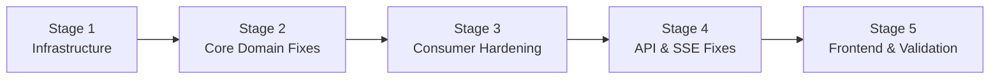

# Implementation Plan — IMS Bug Fixes & Production Hardening

> Reference: [code_review.md](file:///home/observer/.gemini/antigravity/brain/c0b138ac-5dc6-4854-a0e2-43d90b256c5b/code_review.md) · [ims_investigation.md](file:///home/observer/.gemini/antigravity/brain/6c3bb424-20bb-4394-be72-42d243cb3119/ims_investigation.md.resolved) · [design.md](file:///home/observer/projects/ims/docs/design.md)

---

## Consolidated Findings

The investigation report identified 9 bugs. The code review identified 19 findings. After cross-referencing, **12 unique actionable items** remain (excluding CORS and auth per user direction). They are grouped into 5 stages below, ordered by dependency (infrastructure first, then core logic, then consumer, then API, then frontend).

| # | Source | Severity | Description | Stage |
|---|--------|----------|-------------|-------|
| INV-1 | Investigation Bug 1 | 🔴 Critical | Worker crashes at startup — no Kafka healthcheck or restart policy | 1 |
| INV-2 | Investigation Bug 2 | 🔴 Critical | Debounce creates speculative work items before Redis check — race + orphans | 2 |
| INV-3 | Investigation Bug 3 | 🟠 High | `KeyError` on unknown `component_id` crashes consumer | 2 |
| INV-9 | Investigation Bug 9 | 🟠 High | MTTR uses `rca.submitted_at` instead of `resolved_at` — wrong metric | 2 |
| INV-8 | Investigation Bug 8 | 🟡 Medium | `datetime.utcnow()` deprecated — naive datetimes cause comparison issues | 2 |
| INV-5 | Investigation Bug 5 | 🟡 Medium | Offset committed before downstream writes are durable | 3 |
| INV-1b | Investigation Bug 1 | 🟡 Medium | Consumer has no startup retry loop or graceful SIGTERM handler | 3 |
| INV-7 | Investigation Bug 7 | 🟡 Medium | SSE `sleep(0)` spin-locks CPU under load | 4 |
| INV-6 | Investigation Bug 6 | 🟡 Medium | Throughput task ignores `stop_event` during sleep — noisy shutdown | 4 |
| INV-4 | Investigation Bug 4 | 🟡 Medium | SQL parameter index arithmetic is fragile | 4 |
| CR-15 | Code Review #15 | 🟢 Low | Missing `.dockerignore` files bloat build context | 1 |
| CR-10 | Code Review #10 | 🟢 Low | Kafka topic auto-created with 1 partition — no parallelism | 1 |

---

## Stage 1 — Infrastructure Hardening

### What gets changed

- `docker-compose.yml` — Kafka healthcheck, worker `depends_on` condition + restart policy, explicit topic creation via init container
- `backend/.dockerignore` — exclude `.venv`, `__pycache__`, `tests`, `.git`
- `frontend/.dockerignore` — exclude `node_modules`, `.git`, `dist`

> [!NOTE]
> The `version: "3.9"` key has already been removed by the user.

### docker-compose.yml changes

```diff
   kafka:
     image: confluentinc/cp-kafka:7.6.0
     depends_on:
       - zookeeper
     ports:
       - "9092:9092"
     environment:
       # ... existing env vars unchanged ...
+    healthcheck:
+      test: ["CMD", "kafka-topics", "--bootstrap-server", "localhost:29092", "--list"]
+      interval: 10s
+      timeout: 5s
+      retries: 10
+      start_period: 30s
+
+  kafka-init:
+    image: confluentinc/cp-kafka:7.6.0
+    depends_on:
+      kafka:
+        condition: service_healthy
+    entrypoint: ["/bin/sh", "-c"]
+    command: |
+      "kafka-topics --bootstrap-server kafka:29092 --create --if-not-exists --topic signals --partitions 6 --replication-factor 1"
+    restart: "no"

   api:
     build: ./backend
     depends_on:
-      - kafka
-      - redis
-      - mongodb
-      - postgres
+      kafka:
+        condition: service_healthy
+      redis:
+        condition: service_started
+      mongodb:
+        condition: service_started
+      postgres:
+        condition: service_started
     # ... rest unchanged ...

   worker:
     build: ./backend
     depends_on:
-      - kafka
-      - redis
-      - mongodb
-      - postgres
+      kafka-init:
+        condition: service_completed_successfully
+      redis:
+        condition: service_started
+      mongodb:
+        condition: service_started
+      postgres:
+        condition: service_started
     command: ["python", "-m", "app.consumer.signal_consumer"]
+    restart: on-failure
     # ... rest unchanged ...
```

### New files

#### [NEW] `backend/.dockerignore`
```
.venv/
__pycache__/
*.pyc
.pytest_cache/
tests/
.git/
*.md
```

#### [NEW] `frontend/.dockerignore`
```
node_modules/
dist/
.git/
*.md
```

### Acceptance criteria

- [ ] `docker compose up -d` starts all services without errors
- [ ] `docker compose ps` shows `kafka` with health status `healthy`
- [ ] Worker service waits for `kafka-init` to complete before starting
- [ ] `docker compose exec kafka kafka-topics --bootstrap-server localhost:29092 --describe --topic signals` shows 6 partitions
- [ ] Worker restart policy triggers if worker crashes: `docker compose restart worker && docker compose ps` shows worker restarting
- [ ] `docker compose build api` build context size is significantly reduced (no `.venv` or `__pycache__` sent)
- [ ] `docker compose build frontend` build context excludes `node_modules/`

### Git commit

```
fix(infra): kafka healthcheck, explicit topic creation, worker restart

- Kafka healthcheck ensures readiness before dependent services start
- kafka-init container creates 'signals' topic with 6 partitions
- Worker depends_on kafka-init + restart:on-failure for resilience
- Added .dockerignore to backend and frontend to reduce build context
```

### Tests required before next stage

None (infrastructure-only). Verified via acceptance criteria commands.

---

## Stage 2 — Core Domain Fixes

### What gets changed

- `backend/app/core/debounce.py` — **Rewrite**: check Redis first, create DB row only on winner path (fixes INV-2)
- `backend/app/core/alert_strategy.py` — Add fallback for unknown `component_id` (fixes INV-3)
- `backend/app/core/state_machine.py` — Fix MTTR calculation to use `resolved_at` (fixes INV-9)
- `backend/app/models/signal.py` — Replace `datetime.utcnow()` with `datetime.now(timezone.utc)` (fixes INV-8)
- `backend/tests/test_state_machine.py` — Fix deprecated `datetime.utcnow()` in test helpers
- `backend/tests/test_debounce.py` — Update tests for new debounce flow
- `backend/tests/test_alert_strategy.py` — Update unknown component test (now expects fallback, not KeyError)

### debounce.py rewrite specification

The current implementation creates a work item **before** checking Redis, then deletes it if it loses the race. This is inverted from the correct flow. The fix reverses the order:

```python
async def debounce_and_process(signal, redis_client, pg_pool, mongo_db=None) -> str:
    debounce_key = f"debounce:{signal.component_id}"
    
    # Step 1: Attempt to claim the debounce window
    placeholder = str(uuid4())
    claimed = await redis_client.set(debounce_key, placeholder, nx=True, ex=10)
    
    if claimed:
        # Winner: create the work item, update Redis with real ID
        work_item_id = await _create_work_item(pg_pool, signal)
        await redis_client.set(debounce_key, work_item_id, ex=10)  # overwrite placeholder
        await execute_alert(SimpleNamespace(component_id=signal.component_id, ...))
        return "created"
    
    # Loser: increment existing work item's signal count
    existing_id = await redis_client.get(debounce_key)
    if existing_id and existing_id != placeholder:
        await _increment_signal_count(pg_pool, str(existing_id))
    return "deduplicated"
```

Key changes:
- **No speculative INSERT** — the DB row is only created if we win the `SET NX`
- **No DELETE path** — no orphaned rows possible
- **Placeholder → real ID** — brief window uses UUID placeholder, immediately overwritten
- `_delete_work_item` function is removed entirely

### alert_strategy.py change

```diff
 def get_strategy_for_component(component_id: str) -> AlertStrategy:
-    severity = COMPONENT_SEVERITY[component_id]
+    severity = COMPONENT_SEVERITY.get(component_id, "P3")
     return ALERT_STRATEGIES[severity]
```

### state_machine.py MTTR fix

```diff
     def on_enter(self, work_item: WorkItem) -> None:
         if not work_item.has_complete_rca():
             raise RCARequiredError()
-        mttr = work_item.rca.submitted_at - work_item.created_at
+        mttr = work_item.resolved_at - work_item.created_at
         work_item.mttr_seconds = mttr.total_seconds()
```

### signal.py datetime fix

```diff
-from datetime import datetime
+from datetime import datetime, timezone
 
-    timestamp: datetime = Field(default_factory=datetime.utcnow)
+    timestamp: datetime = Field(default_factory=lambda: datetime.now(timezone.utc))
```

### test_alert_strategy.py update

```diff
-def test_unknown_component_raises_key_error() -> None:
-    with pytest.raises(KeyError):
-        alert_strategy.get_strategy_for_component("unknown")
+def test_unknown_component_defaults_to_log_only() -> None:
+    strategy = alert_strategy.get_strategy_for_component("unknown")
+    assert isinstance(strategy, LogOnlyAlertStrategy)
```

### test_state_machine.py MTTR test fix

The test `test_resolved_to_closed_with_rca_sets_mttr` currently passes because `rca.submitted_at` happens to be set to `created_at + 1h`, matching the expected MTTR. After the fix, MTTR will be computed from `resolved_at` — so the test must also set `work_item.resolved_at` explicitly:

```diff
 def test_resolved_to_closed_with_rca_sets_mttr() -> None:
-    created_at = datetime.utcnow() - timedelta(hours=2)
+    created_at = datetime.now(timezone.utc) - timedelta(hours=2)
+    resolved_at = created_at + timedelta(hours=1)
     work_item = make_work_item(status="RESOLVED")
     work_item.created_at = created_at
+    work_item.resolved_at = resolved_at
     machine = WorkItemStateMachine(work_item)

     rca = RCARecord(
         root_cause="Connection pool exhausted due to leak",
         mitigation="Restarted service and raised pool size",
         prevention="Add pool monitoring alert",
         submitted_by="oncall@corp.com",
-        submitted_at=created_at + timedelta(hours=1),
+        submitted_at=created_at + timedelta(hours=2),  # RCA submitted later — shouldn't affect MTTR
     )

     updated = machine.transition_to("CLOSED", rca=rca)

     assert updated.status == "CLOSED"
     assert updated.mttr_seconds == pytest.approx(3600.0)
```

### Acceptance criteria

- [ ] `pytest backend/tests/test_state_machine.py` — all 9 tests pass, MTTR test now verifies `resolved_at - created_at`
- [ ] `pytest backend/tests/test_alert_strategy.py` — all 4 tests pass, unknown component returns `LogOnlyAlertStrategy`
- [ ] `pytest backend/tests/test_debounce.py` — all 5 tests pass with rewritten debounce logic
- [ ] `pytest backend/tests/test_rca_validation.py` — all 4 tests pass (unchanged, regression check)
- [ ] `pytest backend/tests/test_backpressure.py` — all 4 tests pass (unchanged, regression check)
- [ ] No `DeprecationWarning` for `datetime.utcnow()` in pytest output
- [ ] Manual: signal with `component_id: "unknown_service"` does not crash the consumer

### Git commit

```
fix(core): debounce rewrite, MTTR calculation, alert fallback, datetime

- Debounce: check Redis first, create DB row only on winner path
- No more speculative INSERTs or orphaned work items
- MTTR now correctly computed from resolved_at, not rca.submitted_at
- Unknown component_id falls back to P3/LogOnly instead of KeyError crash
- Replaced datetime.utcnow() with datetime.now(timezone.utc) throughout
- 26 unit tests passing
```

### Tests required before next stage

All tests in `test_state_machine.py`, `test_alert_strategy.py`, `test_debounce.py`, `test_rca_validation.py`, `test_backpressure.py` must pass.

---

## Stage 3 — Consumer Hardening

### What gets changed

- `backend/app/consumer/signal_consumer.py` — Startup retry loop, graceful SIGTERM shutdown, per-offset commit (fixes INV-1b, INV-5)

### signal_consumer.py specification

Three changes to the consumer:

**1. Startup retry loop** — Wrap `consumer.start()` in a retry loop using the existing `async_retry` utility (or a simple loop). The worker should attempt to connect to Kafka up to 10 times with exponential backoff before giving up.

```python
async def _start_consumer_with_retry(consumer, max_attempts=10, base_delay=2.0):
    for attempt in range(max_attempts):
        try:
            await consumer.start()
            logger.info("Kafka consumer started successfully")
            return
        except Exception:
            if attempt == max_attempts - 1:
                raise
            delay = min(base_delay * (2 ** attempt), 60.0)
            logger.warning("Kafka not ready, retrying in %.1fs (attempt %d/%d)", delay, attempt + 1, max_attempts)
            await asyncio.sleep(delay)
```

**2. Graceful SIGTERM handler** — Register a signal handler that sets a stop event, causing the consumer loop to exit cleanly before the Docker stop timeout.

```python
shutdown_event = asyncio.Event()

def _handle_signal(signum, frame):
    logger.info("Received signal %s, shutting down...", signum)
    shutdown_event.set()

signal.signal(signal.SIGTERM, lambda *_: shutdown_event.set())
signal.signal(signal.SIGINT, lambda *_: shutdown_event.set())
```

**3. Per-offset commit** — Replace bare `consumer.commit()` with explicit offset commit for the specific message, and move it after all downstream writes succeed.

```diff
-            await consumer.commit()
+            tp = TopicPartition(msg.topic, msg.partition)
+            await consumer.commit({tp: msg.offset + 1})
```

### Acceptance criteria

- [ ] Worker starts successfully even if Kafka takes 20+ seconds to initialize (remove healthcheck temporarily to test)
- [ ] Worker logs retry attempts: `"Kafka not ready, retrying in Xs"`
- [ ] `docker compose stop worker` triggers clean shutdown — no `CancelledError` or `KafkaError` in logs
- [ ] After processing a message, offset is committed only for that specific partition/offset
- [ ] If MongoDB write fails mid-processing, the Kafka offset is NOT committed (message will be redelivered)

### Git commit

```
fix(consumer): startup retry, graceful shutdown, per-offset commit

- Exponential backoff retry on Kafka connection (up to 10 attempts)
- SIGTERM/SIGINT handler for clean Docker stop
- Per-partition offset commit after all downstream writes succeed
- Prevents message loss on partial processing failure
```

### Tests required before next stage

Manual verification via Docker compose. Existing unit tests must still pass.

---

## Stage 4 — API & SSE Fixes

### What gets changed

- `backend/app/api/dashboard.py` — Replace `sleep(0)` with proper backpressure (fixes INV-7)
- `backend/app/main.py` — Fix throughput task shutdown to respond to `stop_event` promptly (fixes INV-6)
- `backend/app/api/work_items.py` — Refactor SQL builder for safety (fixes INV-4)
- `backend/app/api/signals.py` — Fix global rate limit lambda signature (from code review)

### dashboard.py SSE fix

Replace the `sleep(0)` spin-lock with a proper timeout on `get_message`:

```diff
-            message = await pubsub.get_message(
-                ignore_subscribe_messages=True, timeout=1.0
-            )
-            if message and message.get("type") == "message":
-                payload = message.get("data")
-                if isinstance(payload, bytes):
-                    payload = payload.decode("utf-8")
-                yield f"data: {payload}\n\n"
-
-            now = time.monotonic()
-            if now - last_keepalive >= 15:
-                yield ": keep-alive\n\n"
-                last_keepalive = now
-
-            await asyncio.sleep(0)
+            message = await pubsub.get_message(
+                ignore_subscribe_messages=True, timeout=1.0
+            )
+            if message and message.get("type") == "message":
+                payload = message.get("data")
+                if isinstance(payload, bytes):
+                    payload = payload.decode("utf-8")
+                yield f"data: {payload}\n\n"
+                last_keepalive = time.monotonic()
+                continue
+
+            now = time.monotonic()
+            if now - last_keepalive >= 15:
+                yield ": keep-alive\n\n"
+                last_keepalive = now
```

The key change: **remove `await asyncio.sleep(0)`**. The `timeout=1.0` on `get_message` already provides the natural backoff. When a message arrives, we `continue` immediately (responsive). When no message arrives, the 1s timeout naturally throttles. The keepalive fires every 15 seconds of silence.

### main.py throughput shutdown fix

Replace `asyncio.sleep(window)` with an event-aware wait:

```diff
-    while not app.state.stop_event.is_set():
-        await asyncio.sleep(window)
+    while not app.state.stop_event.is_set():
+        try:
+            await asyncio.wait_for(app.state.stop_event.wait(), timeout=window)
+            break  # stop_event was set during the wait
+        except asyncio.TimeoutError:
+            pass  # normal: window elapsed, compute metrics
```

This makes the throughput task respond to `stop_event` **immediately** instead of waiting up to 5 seconds.

### work_items.py SQL builder refactor

Replace the fragile `len(values) - 1` arithmetic with explicit index tracking:

```diff
-    values.append(page_size)
-    values.append(offset)
-    query += f" ORDER BY created_at DESC LIMIT ${len(values) - 1} OFFSET ${len(values)}"
+    limit_idx = len(values) + 1
+    offset_idx = len(values) + 2
+    values.append(page_size)
+    values.append(offset)
+    query += f" ORDER BY created_at DESC LIMIT ${limit_idx} OFFSET ${offset_idx}"
```

### signals.py lambda fix

```diff
-@limiter.limit(settings.rate_limit_global, key_func=lambda: "global")
+@limiter.limit(settings.rate_limit_global, key_func=lambda _request: "global")
```

### Acceptance criteria

- [ ] SSE endpoint does not spin CPU under idle conditions (verify: `docker compose top api` shows low CPU when no signals flowing)
- [ ] SSE keepalive messages appear every ~15 seconds of inactivity
- [ ] `docker compose down` completes within 5 seconds (throughput task exits promptly)
- [ ] `GET /api/v1/work-items?status=OPEN&page=1&page_size=10` returns correct results
- [ ] `GET /api/v1/work-items?page=1&page_size=10` (no filters) also correct
- [ ] Rate limiter still functions correctly after lambda fix
- [ ] `pytest backend/tests/test_api_integration.py` — all 7 tests pass

### Git commit

```
fix(api): SSE spin-lock, throughput shutdown, SQL builder, rate limit

- SSE: removed sleep(0) spin; get_message timeout provides natural backoff
- Throughput task: uses wait_for(stop_event, timeout) for prompt shutdown
- SQL builder: explicit index tracking instead of fragile len() arithmetic
- Rate limit: fixed lambda signature for forward compatibility
```

### Tests required before next stage

All tests in `test_api_integration.py` must pass. SSE verified manually.

---

## Stage 5 — Frontend Polish & Final Validation

### What gets changed

- `frontend/src/App.jsx` — Add React Error Boundary wrapper
- `frontend/src/pages/MetricsPage.jsx` — Add periodic refresh interval
- Full test run and Docker validation

### Error Boundary

```jsx
// frontend/src/components/ErrorBoundary.jsx
import { Component } from "react";

export default class ErrorBoundary extends Component {
  constructor(props) {
    super(props);
    this.state = { hasError: false, error: null };
  }

  static getDerivedStateFromError(error) {
    return { hasError: true, error };
  }

  render() {
    if (this.state.hasError) {
      return (
        <div className="empty-state">
          <h2>Something went wrong</h2>
          <p>{this.state.error?.message}</p>
          <button className="button accent" onClick={() => window.location.reload()}>
            Reload
          </button>
        </div>
      );
    }
    return this.props.children;
  }
}
```

Wrap `App.jsx`:

```diff
+import ErrorBoundary from "./components/ErrorBoundary";
+
 export default function App() {
   const stream = useIncidentStream();

   return (
-    <BrowserRouter>
+    <ErrorBoundary>
+    <BrowserRouter>
       <div className="app-shell">
         ...
       </div>
     </BrowserRouter>
+    </ErrorBoundary>
   );
 }
```

### MetricsPage refresh

```diff
   useEffect(() => {
     let active = true;
-    api.getDashboardMetrics()
-      .then((data) => {
+    const fetchMetrics = () => {
+      api.getDashboardMetrics().then((data) => {
         if (active) {
           setMetrics(Array.isArray(data) ? data : []);
         }
-      })
-      .catch(() => {
+      }).catch(() => {
         if (active) {
           setMetrics([]);
         }
       });
+    };
+
+    fetchMetrics();
+    const interval = setInterval(fetchMetrics, 10000);

     return () => {
       active = false;
+      clearInterval(interval);
     };
   }, []);
```

### Final validation checklist

- [ ] `cd backend && source .venv/bin/activate && pytest -v` — all tests pass (26+ tests)
- [ ] `docker compose up -d --build` — all services start, no errors
- [ ] `docker compose ps` — all containers healthy/running, worker is alive
- [ ] Run seed script: `python scripts/seed_failure_event.py` — 4 work items created
- [ ] Dashboard at `http://localhost:3000` shows 4 incidents in real-time
- [ ] Transition an incident through full lifecycle: OPEN → INVESTIGATING → RESOLVED → submit RCA → CLOSED
- [ ] MTTR displayed correctly (based on `resolved_at - created_at`, not RCA submit time)
- [ ] Metrics page refreshes automatically every 10 seconds
- [ ] Signal with unknown `component_id` (e.g., `billing`) creates a P3 incident, no crash
- [ ] `docker compose down` completes within 5 seconds (clean shutdown)

### Git commit

```
fix(frontend): error boundary, metrics refresh, final validation

- React Error Boundary prevents full-page crashes
- MetricsPage polls every 10 seconds for fresh data
- All 26+ unit tests passing
- Full lifecycle verified: signal → debounce → dashboard → RCA → close
```

### Tests required

All unit tests pass. Seed script succeeds. Manual lifecycle walkthrough complete.

---

## Dependency Graph



Each stage is independently shippable and testable. No stage depends on anything not fixed in a prior stage.

---

## Out of Scope (deferred)

| Item | Reason |
|------|--------|
| Authentication/JWT | User decision — acceptable for demo |
| CORS middleware | User decision — nginx proxy handles same-origin |
| PG pool `min_size`/`max_size` tuning | Config-only, low risk — can be added to `settings` anytime |
| Frontend unit tests | Desirable but not blocking for submission |
| `IncidentCard` live age timer | Cosmetic — acceptable for demo |
