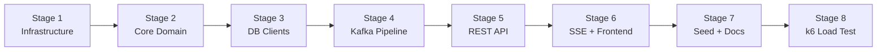

# Implementation Plan — Incident Management System (IMS)

> Reference: [docs/design.md](docs/design.md) · [docs/enriched-context-brief.md](docs/enriched-context-brief.md)

---

## Stage 1 — Infrastructure & Schemas

### What gets built

- `docker-compose.yml` with all 7 services (api, worker, kafka, zookeeper, redis, mongodb, postgres)
- PostgreSQL init script: `backend/db/init.sql` — creates `work_items`, `rca_records` tables, enables TimescaleDB extension, creates `metrics` hypertable
- `backend/Dockerfile` (Python 3.12-slim, copies `app/`, installs `requirements.txt`)
- `backend/requirements.txt` with all pinned dependencies
- `frontend/Dockerfile` (node:20-alpine multi-stage: build React, serve via nginx)
- `frontend/package.json` with React 18, no other deps yet
- `frontend/nginx.conf` with reverse proxy to `/api/` → `api:8000`
- `README.md` with setup instructions
- `docs/` directory with both `design.md` and `enriched-context-brief.md` moved into it

### Docker Compose specifics

| Service | Image | Ports | Volumes |
|---------|-------|-------|---------|
| `postgres` | `timescale/timescaledb:latest-pg16` | 5432 | `pgdata:/var/lib/postgresql/data`, `./backend/db/init.sql:/docker-entrypoint-initdb.d/init.sql` |
| `redis` | `redis:7-alpine` | 6379 | none |
| `mongodb` | `mongo:7` | 27017 | `mongodata:/data/db` |
| `kafka` | `confluentinc/cp-kafka:7.6.0` | 9092 | none |
| `zookeeper` | `confluentinc/cp-zookeeper:7.6.0` | 2181 | none |
| `api` | build `./backend` | 8000 | none |
| `worker` | build `./backend` | none | none, command: `python -m app.consumer.signal_consumer` |
| `frontend` | build `./frontend` | 3000→80 | none |

### PostgreSQL init.sql must contain

```sql
CREATE EXTENSION IF NOT EXISTS timescaledb;

CREATE TABLE work_items (
    id UUID PRIMARY KEY DEFAULT gen_random_uuid(),
    component_id VARCHAR(255) NOT NULL,
    severity VARCHAR(10) NOT NULL,
    status VARCHAR(20) NOT NULL DEFAULT 'OPEN',
    title TEXT NOT NULL,
    assignee VARCHAR(255),
    signal_count INTEGER NOT NULL DEFAULT 1,
    created_at TIMESTAMPTZ NOT NULL DEFAULT NOW(),
    updated_at TIMESTAMPTZ NOT NULL DEFAULT NOW(),
    resolved_at TIMESTAMPTZ,
    mttr_seconds DOUBLE PRECISION
);
CREATE INDEX idx_work_items_component ON work_items(component_id);
CREATE INDEX idx_work_items_status ON work_items(status);

CREATE TABLE rca_records (
    id UUID PRIMARY KEY DEFAULT gen_random_uuid(),
    work_item_id UUID NOT NULL UNIQUE REFERENCES work_items(id),
    root_cause TEXT NOT NULL CHECK (char_length(root_cause) >= 20),
    mitigation TEXT NOT NULL CHECK (char_length(mitigation) > 0),
    prevention TEXT NOT NULL CHECK (char_length(prevention) > 0),
    submitted_by VARCHAR(255) NOT NULL,
    submitted_at TIMESTAMPTZ NOT NULL DEFAULT NOW()
);

CREATE TABLE metrics (
    time TIMESTAMPTZ NOT NULL,
    metric_name VARCHAR(100) NOT NULL,
    value DOUBLE PRECISION NOT NULL,
    labels JSONB DEFAULT '{}'
);
SELECT create_hypertable('metrics', 'time');
```

### requirements.txt

```
fastapi==0.115.0
uvicorn[standard]==0.30.0
aiokafka==0.10.0
asyncpg==0.29.0
motor==3.5.0
redis[hiredis]==5.1.0
pydantic==2.9.0
pydantic-settings==2.5.0
slowapi==0.1.9
httpx==0.27.0
pytest==8.3.0
pytest-asyncio==0.24.0
```

### Acceptance criteria

- [x] `docker compose up -d` starts all 7 containers without errors
- [x] `docker compose exec postgres psql -U postgres -d ims -c "\dt"` shows `work_items`, `rca_records`, `metrics`
- [x] `docker compose exec postgres psql -U postgres -d ims -c "\dx"` shows `timescaledb`
- [x] `docker compose exec postgres psql -U postgres -d ims -c "SELECT * FROM timescaledb_information.hypertables"` shows `metrics`
- [x] `docker compose exec redis redis-cli PING` returns `PONG`
- [x] `docker compose exec mongodb mongosh --eval "db.runCommand({ping:1})"` returns `ok: 1`
- [x] Kafka topic can be created: `docker compose exec kafka kafka-topics --bootstrap-server localhost:9092 --create --topic signals --partitions 4 --replication-factor 1`
- [x] `backend/app/__init__.py` exists (empty, makes it a package)
- [x] `README.md` has "Quick Start" section with `docker compose up -d`

### Git commit

```
feat(infra): docker-compose with postgres, redis, mongo, kafka, init schemas

- TimescaleDB extension enabled, metrics hypertable created
- work_items and rca_records tables with constraints
- All 7 services healthy on compose up
```

### Tests required before next stage

None (infrastructure-only stage). Verified manually via acceptance criteria commands.

---

## Stage 2 — Core Domain: State Machine + Alert Strategy + Debounce

### What gets built

- `backend/app/core/state_machine.py` — State Pattern for incident lifecycle
- `backend/app/core/alert_strategy.py` — Strategy Pattern for alerting
- `backend/app/core/debounce.py` — Redis debounce logic (standalone, testable)
- `backend/app/models/signal.py` — Pydantic model for incoming signals
- `backend/app/models/work_item.py` — Pydantic model for work items
- `backend/app/models/rca.py` — Pydantic model for RCA submission
- `backend/app/config.py` — pydantic-settings config class
- `backend/tests/test_state_machine.py`
- `backend/tests/test_alert_strategy.py`
- `backend/tests/test_rca_validation.py`

### state_machine.py design

- Abstract base: `IncidentState` with `allowed_transitions() -> list[str]`, `on_enter(work_item)`, `validate_transition(target, work_item)`
- Concrete states: `OpenState`, `InvestigatingState`, `ResolvedState`, `ClosedState`
- `ClosedState.on_enter()` raises `RCARequiredError` if `work_item.rca` is None
- `InvestigatingState.on_enter()` raises `AssigneeRequiredError` if `work_item.assignee` is None
- `ResolvedState.on_enter()` sets `work_item.resolved_at = now()`
- `STATE_MAP: dict[str, type[IncidentState]]` for lookup
- `WorkItemStateMachine` class wrapping transition logic

### alert_strategy.py design

- Abstract base: `AlertStrategy` with `async execute(work_item) -> None`
- Concrete: `PagerDutyAlertStrategy` (P0), `SlackUrgentAlertStrategy` (P1), `SlackAlertStrategy` (P2), `LogOnlyAlertStrategy` (P3)
- All concrete strategies log their action (no real integrations needed)
- `ALERT_STRATEGIES: dict[str, AlertStrategy]` registry
- `COMPONENT_SEVERITY: dict[str, str]` mapping
- `async def execute_alert(work_item)` convenience function

### Pydantic models

**SignalIn:**
```python
class SignalIn(BaseModel):
    signal_id: UUID = Field(default_factory=uuid4)
    component_id: str = Field(..., min_length=1, max_length=255)
    timestamp: datetime = Field(default_factory=datetime.utcnow)
    severity_hint: str | None = None
    source: str
    metadata: dict = Field(default_factory=dict)
```

**WorkItemOut:**
```python
class WorkItemOut(BaseModel):
    id: UUID
    component_id: str
    severity: str
    status: str
    title: str
    assignee: str | None
    signal_count: int
    created_at: datetime
    updated_at: datetime
    resolved_at: datetime | None
    mttr_seconds: float | None
```

**RCAIn:**
```python
class RCAIn(BaseModel):
    root_cause: str = Field(..., min_length=20)
    mitigation: str = Field(..., min_length=1)
    prevention: str = Field(..., min_length=1)
    submitted_by: EmailStr
```

### Acceptance criteria

- [x] `pytest backend/tests/test_state_machine.py` passes with 8+ tests:
  - OPEN → INVESTIGATING succeeds
  - OPEN → CLOSED raises InvalidTransitionError
  - INVESTIGATING → RESOLVED succeeds
  - INVESTIGATING → OPEN (re-open) succeeds
  - RESOLVED → CLOSED without RCA raises RCARequiredError
  - RESOLVED → CLOSED with valid RCA succeeds and computes mttr_seconds
  - RESOLVED → INVESTIGATING (re-investigate) succeeds
  - CLOSED → anything raises InvalidTransitionError (terminal)
- [x] `pytest backend/tests/test_alert_strategy.py` passes with 4+ tests:
  - P0 component selects PagerDutyAlertStrategy
  - P1 component selects SlackUrgentAlertStrategy
  - Unknown component raises KeyError or uses fallback
  - execute_alert calls strategy.execute exactly once
- [x] `pytest backend/tests/test_rca_validation.py` passes with 4+ tests:
  - RCAIn with root_cause < 20 chars rejected
  - RCAIn with empty mitigation rejected
  - RCAIn with invalid email rejected
  - Valid RCAIn accepted
- [x] All models importable: `from app.models.signal import SignalIn` etc.
- [x] `from app.config import settings` works with env vars

### Git commit

```
feat(core): state machine, alert strategy, debounce, pydantic models

- State Pattern: 4 states, RCA gate on CLOSED, MTTR computed on transition
- Strategy Pattern: 4 alert strategies, config-driven severity mapping
- Pydantic models with validation (signal, work_item, rca)
- 16+ unit tests passing
```

### Tests required before next stage

All tests in `test_state_machine.py`, `test_alert_strategy.py`, `test_rca_validation.py` must pass.

---

## Stage 3 — Database Clients & Backpressure

### What gets built

- `backend/app/db/postgres.py` — asyncpg connection pool (init, close, acquire context manager)
- `backend/app/db/mongodb.py` — motor client (init, close, get_collection)
- `backend/app/db/redis_client.py` — redis.asyncio client (init, close, get_client)
- `backend/app/db/kafka.py` — aiokafka producer + consumer factory
- `backend/app/core/backpressure.py` — `async_retry` decorator with exponential backoff + DLQ
- `backend/tests/test_backpressure.py`

### async_retry specification

```python
async def async_retry(
    operation: Callable,
    max_retries: int = 5,
    base_delay: float = 0.1,
    max_delay: float = 30.0,
    on_failure: Callable | None = None  # DLQ callback
) -> Any
```

- Catches `ConnectionError`, `TimeoutError`, `asyncpg.PostgresError`, `pymongo.errors.PyMongoError`
- Delay formula: `min(base_delay * (2 ** attempt), max_delay)` + jitter (±10%)
- After `max_retries` exhausted: calls `on_failure` if provided, then raises

### DB client pattern

Each client module exports:
- `async def init_pool() -> None` (called on app startup)
- `async def close_pool() -> None` (called on app shutdown)
- A way to get a connection/client for use in route handlers

### Acceptance criteria

- [ ] `pytest backend/tests/test_backpressure.py` passes with 4+ tests:
  - Succeeds on first try → returns result, no delay
  - Fails twice then succeeds → retries with increasing delay
  - Fails all 5 attempts → calls on_failure callback, raises
  - Jitter is applied (delay is not exactly `2^n * base`)
- [ ] Each db module is importable and has `init_pool`, `close_pool`
- [ ] `backend/app/db/__init__.py` exists

### Git commit

```
feat(db): async database clients with retry/backpressure

- asyncpg, motor, redis, aiokafka client modules
- async_retry with exponential backoff, jitter, DLQ callback
- 4 backpressure unit tests passing
```

### Tests required before next stage

All tests in `test_backpressure.py` must pass.

---

## Stage 4 — Kafka Consumer Pipeline

### What gets built

- `backend/app/consumer/signal_consumer.py` — Kafka consumer loop
- `backend/app/core/debounce.py` updated with full Redis logic
- `backend/tests/test_debounce.py`
- `backend/app/consumer/__init__.py`

### Consumer loop specification

1. Create aiokafka `AIOKafkaConsumer` for topic `signals`, group `ims-workers`
2. On each message:
   a. Deserialize JSON → `SignalIn`
   b. Insert raw signal into MongoDB `raw_signals` collection (with `async_retry`)
   c. Call `debounce_and_process(signal)` (the debounce function from design.md)
   d. Publish SSE event to Redis Pub/Sub channel `incidents`
3. Commit offset after successful processing
4. Run as `__main__` entry point: `python -m app.consumer.signal_consumer`

### debounce.py specification

```python
async def debounce_and_process(signal: SignalIn, redis, pg_pool, mongo_db) -> str:
    """Returns 'created' or 'deduplicated'"""
```

- Creates work item in PostgreSQL FIRST
- Single `SET debounce:{component_id} {work_item_id} NX EX 10`
- Winner: keeps work item, fires alert strategy, returns 'created'
- Loser: deletes speculative work item, increments existing signal_count, returns 'deduplicated'

### Acceptance criteria

- [ ] `pytest backend/tests/test_debounce.py` passes with 5+ tests:
  - First signal for a component → work item created, returns 'created'
  - Second signal within 10s → deduped, signal_count incremented, returns 'deduplicated'
  - Signal after 10s window expires → new work item created
  - Concurrent signals (simulated) → exactly one winner
  - signal_count matches total signals received
- [ ] Consumer starts via `python -m app.consumer.signal_consumer` (exits if Kafka not available, logged)
- [ ] Consumer processes a manually produced Kafka message end-to-end (integration test with docker compose)

### Git commit

```
feat(pipeline): kafka consumer with debounce and signal processing

- Consumer loop: deserialize, store, debounce, alert, publish
- Debounce: create-first, SET NX atomic, speculative cleanup
- 5 debounce unit tests passing
```

### Tests required before next stage

All tests in `test_debounce.py` must pass.

---

## Stage 5 — REST API + Health Endpoint

### What gets built

- `backend/app/main.py` — FastAPI app with lifespan (init/close all DB pools)
- `backend/app/api/signals.py` — `POST /api/v1/signals`
- `backend/app/api/work_items.py` — `GET /api/v1/work-items`, `GET /api/v1/work-items/{id}`, `PATCH /api/v1/work-items/{id}/transition`
- `backend/app/api/rca.py` — `POST /api/v1/work-items/{id}/rca`
- `backend/app/api/dashboard.py` — `GET /api/v1/dashboard/active`, `GET /api/v1/dashboard/metrics`
- `backend/app/api/health.py` — `GET /health`
- `backend/app/api/__init__.py` — router aggregation
- `backend/tests/test_api_integration.py`
- Throughput counter + 5-second console logger as background task

### Endpoint details

**POST /api/v1/signals:**
- Rate limit: `slowapi` — 10000/second global, 1000/second per IP
- Validate with `SignalIn`
- Produce to Kafka topic `signals` (key=component_id)
- Return `202 Accepted` with `{ "signal_id": "...", "status": "queued" }`
- On Kafka timeout: return `503`
- Increment atomic signal counter

**PATCH /api/v1/work-items/{id}/transition:**
- Body: `{ "target_status": "...", "assignee": "..." }`
- `SELECT FOR UPDATE` the work item
- Instantiate state machine, validate transition
- Return 200 with updated work item or 409 with error + allowed_transitions

**POST /api/v1/work-items/{id}/rca:**
- Validate `RCAIn` body
- Check work item is RESOLVED (else 409)
- Insert RCA record
- Transition to CLOSED via state machine (computes MTTR)
- Return 201 with RCA + MTTR

**GET /health:**
- Probe all 4 stores (Redis PING, PG `SELECT 1`, Mongo `ping`, Kafka metadata)
- Return status `healthy` or `degraded`
- Include `throughput.signals_per_second` from counter

### Throughput logger

- `asyncio.create_task` in lifespan startup
- Every 5 seconds: read+reset atomic counter, log `[THROUGHPUT] {rate:.1f} signals/sec`, write to TimescaleDB `metrics` table

### Acceptance criteria

- [ ] `curl -X POST http://localhost:8000/api/v1/signals -H 'Content-Type: application/json' -d '{"component_id":"database","source":"test"}'` returns 202
- [ ] 11th request from same IP within 1 second returns 429 (test rate limit per-IP at 1000)
- [ ] `GET /api/v1/work-items` returns paginated list (default page_size=20)
- [ ] `PATCH .../transition` with invalid transition returns 409 with `allowed_transitions`
- [ ] `POST .../rca` with root_cause < 20 chars returns 422
- [ ] `POST .../rca` on a RESOLVED work item succeeds, returns 201, mttr_seconds is set
- [ ] `GET /health` returns JSON with all 4 component statuses
- [ ] Console logs `[THROUGHPUT]` every 5 seconds
- [ ] `pytest backend/tests/test_api_integration.py` passes with 6+ tests

### Git commit

```
feat(api): REST endpoints, health check, throughput logging

- Signal ingestion with rate limiting (slowapi)
- Work item CRUD with state machine transitions
- RCA submission with validation + auto-close
- /health with component probes and throughput metric
- 5-second console throughput logger
```

### Tests required before next stage

All tests in `test_api_integration.py` must pass. Manual curl verification of all endpoints.

---

## Stage 6 — SSE Real-Time + React Frontend

### What gets built

- `backend/app/api/dashboard.py` updated with `GET /api/v1/stream/events` SSE endpoint
- `frontend/src/` — full React application:
  - `App.jsx` with routing (react-router-dom)
  - `hooks/useIncidentStream.js` — EventSource hook
  - `components/IncidentList.jsx`
  - `components/IncidentCard.jsx`
  - `components/IncidentDetail.jsx`
  - `components/RCAForm.jsx`
  - `components/MetricsBar.jsx`
  - `components/StateTransitionPanel.jsx`
  - `api/client.js` — fetch wrappers for all REST endpoints
- `frontend/nginx.conf` updated

### SSE endpoint specification

```python
@router.get("/stream/events")
async def stream_events(request: Request):
    return StreamingResponse(
        event_generator(request),
        media_type="text/event-stream",
        headers={"X-Accel-Buffering": "no", "Cache-Control": "no-cache"}
    )
```

- `event_generator` subscribes to Redis Pub/Sub channel `incidents`
- Yields `data: {json}\n\n` for each message
- Sends `: keep-alive\n\n` every 15 seconds if no data
- Checks `request.is_disconnected()` each iteration
- **`try/finally` wraps the loop: `finally` calls `pubsub.unsubscribe()` and `pubsub.close()`**

### React specifics

- Use Vite for build tooling (fast, minimal config)
- CSS: vanilla CSS with CSS custom properties for theming (dark mode default)
- `IncidentCard` shows: severity badge (color-coded P0-P3), status pill, component_id, signal_count, age (relative time)
- `StateTransitionPanel` only shows buttons for `allowed_transitions` of current state
- `RCAForm` only renders when status is RESOLVED
- `MetricsBar` shows signals/sec (from SSE `metrics.throughput` events), active incident count, average MTTR

### Acceptance criteria

- [ ] Open `http://localhost:3000` — dashboard loads with header and empty incident list
- [ ] Send a signal via curl → incident card appears on dashboard within 2 seconds (no page refresh)
- [ ] Transition a work item → dashboard updates status in real-time
- [ ] RCA form appears only on RESOLVED incidents
- [ ] Submit valid RCA → incident disappears from active list
- [ ] SSE connection survives for 60+ seconds without dropping
- [ ] Browser DevTools Network tab shows `text/event-stream` connection to `/api/v1/stream/events`
- [ ] Disconnecting client does not leak Redis connections (verify with `redis-cli CLIENT LIST`)
- [ ] Frontend builds without errors: `cd frontend && npm run build`

### Git commit

```
feat(frontend): react dashboard with SSE live feed

- EventSource hook for real-time incident updates
- Incident list, detail, state transitions, RCA form
- SSE endpoint with Redis Pub/Sub and connection cleanup
- Dark-themed UI with severity color coding
```

### Tests required before next stage

Frontend builds without errors. SSE connection verified manually. Redis connection cleanup verified via `CLIENT LIST`.

---

## Stage 7 — Seed Script + Documentation

### What gets built

- `scripts/seed_failure_event.py` — simulates RDBMS outage → MCP failure cascade
- `README.md` updated with:
  - Architecture diagram (copy from design.md)
  - Backpressure section explaining the 5-layer chain
  - Quick start instructions
  - API endpoint table
  - How to run seed script
- `docs/` directory confirmed with `design.md` and `enriched-context-brief.md`

### Seed script specification

The script sends a burst of signals simulating an RDBMS outage that cascades:

1. **T=0s:** 50 signals for `database` (P0) — primary DB unreachable
2. **T=2s:** 30 signals for `api_gateway` (P1) — APIs failing due to DB
3. **T=4s:** 20 signals for `cache` (P2) — cache invalidation failing
4. **T=6s:** 10 signals for `payment_service` (P1) — payment processing down

Script uses `httpx.AsyncClient` to POST to `http://localhost:8000/api/v1/signals`.

Expected outcome:
- 4 work items created (one per component, all others deduped)
- P0 alert triggered for database
- Dashboard shows 4 active incidents with correct signal counts

### Acceptance criteria

- [ ] `python scripts/seed_failure_event.py` completes without errors
- [ ] `GET /api/v1/work-items` returns exactly 4 work items after seed
- [ ] Work item for `database` has `signal_count >= 50` and `severity = P0`
- [ ] Work item for `cache` has `severity = P2`
- [ ] Dashboard shows all 4 incidents in real-time during seed execution
- [ ] `README.md` has Architecture Diagram, Backpressure, Quick Start, API sections
- [ ] `docs/design.md` and `docs/enriched-context-brief.md` exist

### Git commit

```
feat(docs): seed script, README with architecture and backpressure

- seed_failure_event.py simulates RDBMS → cascade failure
- README with architecture diagram, backpressure chain, API reference
- All documentation checked into docs/
```

### Tests required before next stage

Seed script runs successfully. README renders correctly on GitHub.

---

## Stage 8 — k6 Load Test + Final Validation

### What gets built

- `scripts/load-test.js` — k6 load test script
- Final validation pass: all tests green, all acceptance criteria verified

### k6 script specification

```javascript
// scripts/load-test.js
import http from 'k6/http';
import { check, sleep } from 'k6';

export const options = {
    stages: [
        { duration: '30s', target: 5000 },   // ramp up to 5000 VUs
        { duration: '1m',  target: 10000 },   // ramp to 10000 VUs (peak)
        { duration: '30s', target: 0 },       // ramp down
    ],
    thresholds: {
        'checks': ['rate>0.95'],  // 95% of checks must pass
    },
};

const SIGNAL_PAYLOAD = JSON.stringify({
    component_id: `db-${__VU}`,  // spread across components
    source: 'k6-load-test',
    metadata: { test: true },
});

export default function () {
    const res = http.post(
        'http://localhost:8000/api/v1/signals',
        SIGNAL_PAYLOAD,
        { headers: { 'Content-Type': 'application/json' } }
    );

    check(res, {
        'status is 202 or 429': (r) => r.status === 202 || r.status === 429,
        'no 500 errors': (r) => r.status !== 500,
    });
}

// Validate /health after test
export function teardown() {
    const health = http.get('http://localhost:8000/health');
    check(health, {
        'health returns 200': (r) => r.status === 200,
        'throughput metric exists': (r) => {
            const body = JSON.parse(r.body);
            return body.throughput && body.throughput.signals_per_second !== undefined;
        },
    });
}
```

### Acceptance criteria

- [ ] `k6 run scripts/load-test.js` completes all 3 stages without script errors
- [ ] k6 summary shows `checks` rate > 95%
- [ ] Zero HTTP 500 responses during the entire run
- [ ] `/health` endpoint returns valid throughput metric after test
- [ ] Console logs show `[THROUGHPUT]` values > 0 during peak load
- [ ] `docker compose logs worker` shows consumer processing signals throughout
- [ ] No OOM kills or container restarts during test: `docker compose ps` shows all healthy
- [ ] All unit tests still pass: `cd backend && pytest`

### Git commit

```
feat(test): k6 load test — 10K signals/sec burst validation

- Staged ramp: 0 → 5000 → 10000 → 0 VUs
- 95% of responses must be 202 or 429, zero 500s
- Validates /health throughput metric in teardown
- Demonstrates Concurrency & Scaling rubric compliance
```

### Tests required

All unit tests pass. k6 thresholds pass. Docker Compose stable under load.

---

## Dependency Graph



Each stage is independently shippable and testable. No stage depends on anything not built in a prior stage.
